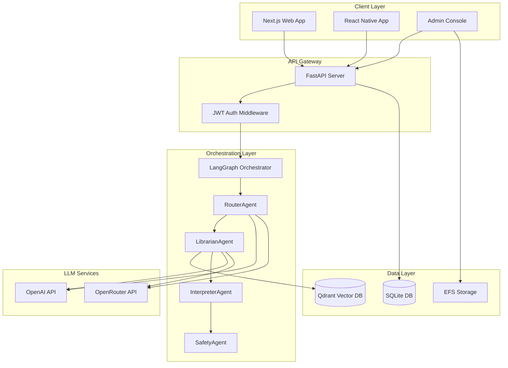
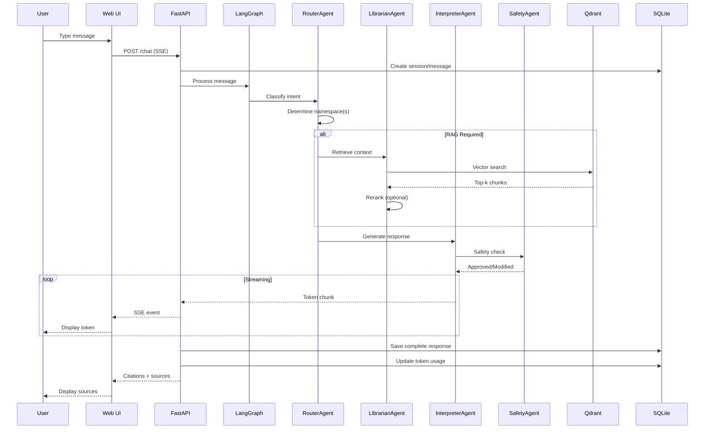
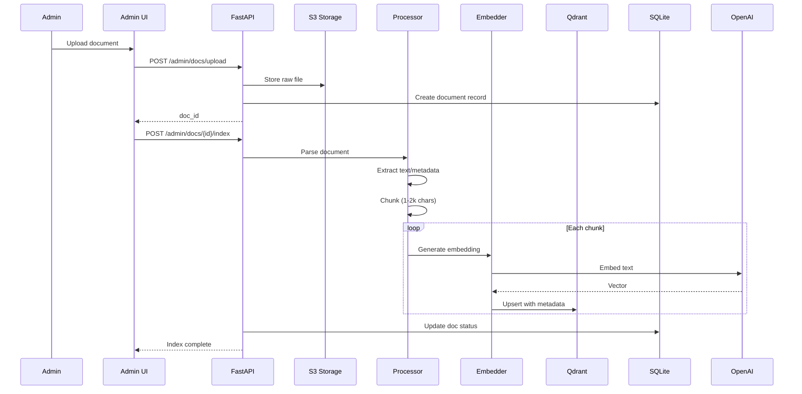
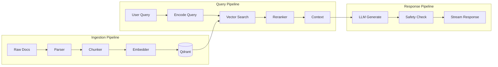
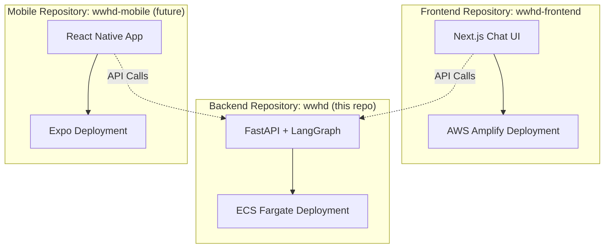
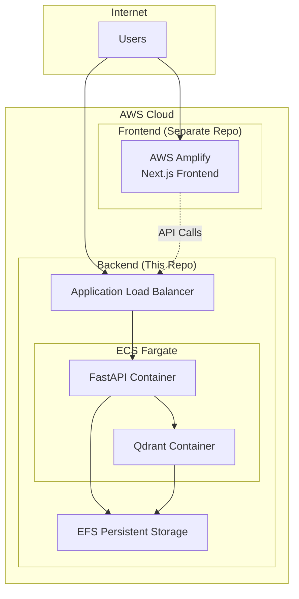
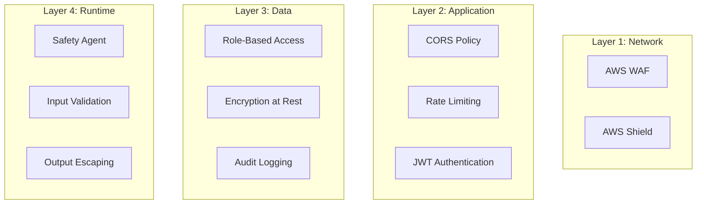
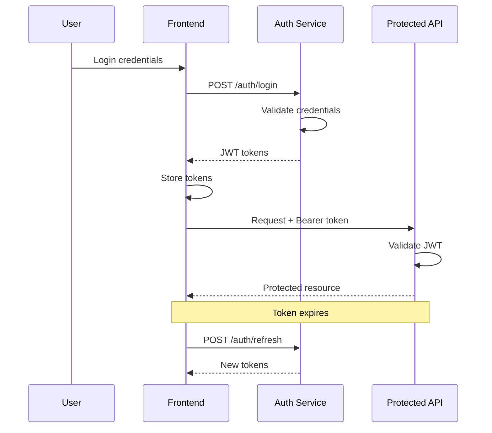

# Architecture

## System Overview



## Component Architecture

### Backend Services

| Component | Technology | Purpose |
|-----------|------------|---------|
| API Server | FastAPI 0.100+ | REST endpoints, WebSocket/SSE streaming |
| Agent Orchestrator | LangGraph 0.1+ | Multi-agent state machine |
| Vector Store | Qdrant 1.7+ | RAG retrieval with namespaces |
| Database | SQLite 3.35+ | Chat history, users, token accounting |
| Cache | Redis (optional) | Session cache, rate limiting |
| Queue | Celery (optional) | Document processing jobs |

### Multi-Repository Structure

| Repository | Technology | Deployment | Purpose |
|------------|------------|------------|---------||
| **wwhd** (Backend) | FastAPI + LangGraph | ECS Fargate | API server, agent orchestration |
| **wwhd-frontend** | Next.js 14 + assistant-ui | AWS Amplify | Web chat interface |
| **wwhd-mobile** (Future) | React Native 0.72+ | Expo + App Store | Mobile chat client |

## Sequence Diagrams

### Chat Flow



### Document Ingestion Flow



## Data Flow



## LangGraph State Schema

```python
from typing import TypedDict, List, Optional, Literal
from datetime import datetime

class ConversationState(TypedDict):
    # Message context
    user_id: str
    session_id: str
    message_id: str
    user_message: str
    timestamp: datetime

    # Routing
    intent: Optional[str]
    confidence: float
    selected_namespaces: List[str]
    selected_agents: List[str]

    # RAG context
    retrieved_chunks: List[dict]  # {text, metadata, score}
    reranked_chunks: Optional[List[dict]]

    # Generation
    system_prompt: str
    safety_flags: List[str]
    response_tokens: List[str]
    final_response: str
    citations: List[dict]  # {source_title, url, timestamp}

    # Accounting
    prompt_tokens: int
    completion_tokens: int
    embedding_tokens: int
    total_cost: float

    # Control flow
    current_node: str
    next_node: Optional[str]
    error: Optional[str]
    status: Literal["processing", "streaming", "complete", "error"]
```

## Network Architecture

### Multi-Repository Architecture



### ECS Fargate Deployment (Current Implementation)



## Scaling Considerations

### Horizontal Scaling Points

1. **API Server**: Multiple FastAPI instances behind ALB
2. **LangGraph Workers**: Separate worker pool for agent execution
3. **Qdrant**: Cluster mode with replicas
4. **Database**: Read replicas for query load

### Vertical Scaling Points

1. **Model Selection**: gpt-4o-mini → gpt-4o → claude-3
2. **Embedding Dimensions**: 1536 → 3072 dimensions
3. **Chunk Size**: 1000 → 2000 → 4000 tokens
4. **Cache Layer**: Add Redis for session state

### Performance Targets

| Metric | Target | Current |
|--------|--------|---------|
| Chat Latency (p50) | < 5s | - |
| Chat Latency (p95) | < 10s | - |
| Document Index Time | < 30s/MB | - |
| Concurrent Users | 100 | - |
| Requests/second | 50 | - |
| Uptime | 99.9% | - |

## Security Architecture

### Defense in Depth



### Authentication Flow



## Monitoring Architecture

### Observability Stack

| Component | Purpose | Tool Options |
|-----------|---------|--------------|
| Metrics | Performance tracking | CloudWatch, Datadog |
| Logs | Centralized logging | CloudWatch Logs, ELK |
| Traces | Distributed tracing | X-Ray, Jaeger |
| APM | Application monitoring | New Relic, AppDynamics |
| Synthetic | Uptime monitoring | Pingdom, StatusCake |

### Key Metrics

```yaml
Infrastructure:
  - CPU utilization
  - Memory usage
  - Network I/O
  - Disk I/O

Application:
  - Request rate
  - Error rate
  - Response time (p50, p95, p99)
  - Active sessions

Business:
  - Daily active users
  - Messages per user
  - Token usage per user
  - Namespace hit rates
  - Citation click-through rate

AI/ML:
  - Router accuracy
  - Retrieval precision@k
  - Response quality scores
  - Safety intervention rate
```

## Disaster Recovery

### Backup Strategy

| Component | Frequency | Retention | Recovery Time |
|-----------|-----------|-----------|---------------|
| Database | Daily | 30 days | < 1 hour |
| Qdrant | Daily | 7 days | < 2 hours |
| Documents | Real-time | Indefinite | Immediate |
| Config | On change | Indefinite | < 30 min |

### Failure Scenarios

1. **LLM Service Outage**: Fallback to alternate provider (OpenAI ↔ OpenRouter)
2. **Qdrant Failure**: Serve from cache, degraded experience warning
3. **Database Corruption**: Restore from backup, replay from event log
4. **Region Failure**: Multi-region standby (future)

## Cost Optimization

### Resource Allocation

```yaml
Development:
  Backend: 1 vCPU, 2 GB RAM
  Qdrant: 1 vCPU, 2 GB RAM
  Database: db.t3.micro

Staging:
  Backend: 2 vCPU, 4 GB RAM
  Qdrant: 2 vCPU, 4 GB RAM
  Database: db.t3.small

Production:
  Backend: 4 vCPU, 8 GB RAM (auto-scale 2-10)
  Qdrant: 4 vCPU, 16 GB RAM (cluster)
  Database: db.m5.large (with read replica)
```

### Cost Controls

1. **Token Limits**: Max tokens per request, daily user limits
2. **Caching**: Aggressive caching of embeddings and common queries
3. **Model Selection**: Use smaller models for classification/routing
4. **Batch Processing**: Group embedding requests
5. **Spot Instances**: Use for non-critical workloads

## Acceptance Criteria

- ✅ System handles 50 concurrent users
- ✅ Auto-scales based on load
- ✅ Failover completes in < 60 seconds
- ✅ All components containerized
- ✅ Infrastructure as Code (ECS setup scripts)
- ✅ Zero-downtime deployments
- ✅ Monitoring alerts configured