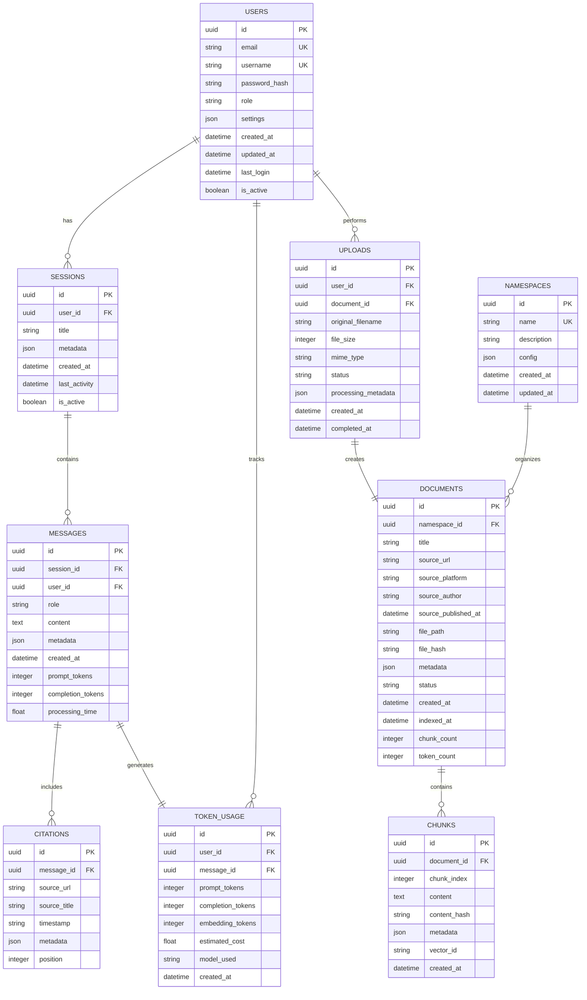

# Data Model

## Database Architecture

### SQLite Configuration (Development)

```yaml
database:
  type: sqlite
  path: ./data/app.db
  pragmas:
    journal_mode: WAL
    synchronous: NORMAL
    cache_size: -64000  # 64MB
    temp_store: MEMORY
    mmap_size: 30000000000  # 30GB
```

### PostgreSQL Migration (Production)

```yaml
database:
  type: postgresql
  host: ${DB_HOST}
  port: 5432
  database: wwhd
  pool_size: 20
  max_overflow: 10
```

## Entity Relationship Diagram



## Table Schemas

### Users Table

```sql
CREATE TABLE users (
    id UUID PRIMARY KEY DEFAULT gen_random_uuid(),
    email VARCHAR(255) UNIQUE NOT NULL,
    username VARCHAR(50) UNIQUE NOT NULL,
    password_hash VARCHAR(255) NOT NULL,
    role VARCHAR(20) NOT NULL DEFAULT 'user' CHECK (role IN ('user', 'admin', 'viewer')),
    settings JSONB DEFAULT '{}',
    created_at TIMESTAMP WITH TIME ZONE DEFAULT CURRENT_TIMESTAMP,
    updated_at TIMESTAMP WITH TIME ZONE DEFAULT CURRENT_TIMESTAMP,
    last_login TIMESTAMP WITH TIME ZONE,
    is_active BOOLEAN DEFAULT true,
    
    INDEX idx_users_email (email),
    INDEX idx_users_username (username),
    INDEX idx_users_role (role),
    INDEX idx_users_active (is_active)
);
```

### Sessions Table

```sql
CREATE TABLE sessions (
    id UUID PRIMARY KEY DEFAULT gen_random_uuid(),
    user_id UUID NOT NULL REFERENCES users(id) ON DELETE CASCADE,
    title VARCHAR(255),
    metadata JSONB DEFAULT '{}',
    created_at TIMESTAMP WITH TIME ZONE DEFAULT CURRENT_TIMESTAMP,
    last_activity TIMESTAMP WITH TIME ZONE DEFAULT CURRENT_TIMESTAMP,
    is_active BOOLEAN DEFAULT true,
    
    INDEX idx_sessions_user (user_id),
    INDEX idx_sessions_active (is_active),
    INDEX idx_sessions_activity (last_activity DESC)
);
```

### Messages Table

```sql
CREATE TABLE messages (
    id UUID PRIMARY KEY DEFAULT gen_random_uuid(),
    session_id UUID NOT NULL REFERENCES sessions(id) ON DELETE CASCADE,
    user_id UUID NOT NULL REFERENCES users(id) ON DELETE CASCADE,
    role VARCHAR(20) NOT NULL CHECK (role IN ('user', 'assistant', 'system')),
    content TEXT NOT NULL,
    metadata JSONB DEFAULT '{}',
    created_at TIMESTAMP WITH TIME ZONE DEFAULT CURRENT_TIMESTAMP,
    prompt_tokens INTEGER DEFAULT 0,
    completion_tokens INTEGER DEFAULT 0,
    processing_time FLOAT,
    
    INDEX idx_messages_session (session_id),
    INDEX idx_messages_user (user_id),
    INDEX idx_messages_created (created_at DESC)
);
```

### Citations Table

```sql
CREATE TABLE citations (
    id UUID PRIMARY KEY DEFAULT gen_random_uuid(),
    message_id UUID NOT NULL REFERENCES messages(id) ON DELETE CASCADE,
    source_url TEXT,
    source_title VARCHAR(500),
    timestamp VARCHAR(20),
    metadata JSONB DEFAULT '{}',
    position INTEGER NOT NULL,
    
    INDEX idx_citations_message (message_id),
    UNIQUE (message_id, position)
);
```

### Token Usage Table

```sql
CREATE TABLE token_usage (
    id UUID PRIMARY KEY DEFAULT gen_random_uuid(),
    user_id UUID NOT NULL REFERENCES users(id) ON DELETE CASCADE,
    message_id UUID REFERENCES messages(id) ON DELETE SET NULL,
    prompt_tokens INTEGER NOT NULL DEFAULT 0,
    completion_tokens INTEGER NOT NULL DEFAULT 0,
    embedding_tokens INTEGER NOT NULL DEFAULT 0,
    estimated_cost DECIMAL(10, 6),
    model_used VARCHAR(100),
    created_at TIMESTAMP WITH TIME ZONE DEFAULT CURRENT_TIMESTAMP,
    
    INDEX idx_token_usage_user (user_id),
    INDEX idx_token_usage_created (created_at DESC),
    INDEX idx_token_usage_user_daily (user_id, DATE(created_at))
);
```

### Namespaces Table

```sql
CREATE TABLE namespaces (
    id UUID PRIMARY KEY DEFAULT gen_random_uuid(),
    name VARCHAR(50) UNIQUE NOT NULL,
    description TEXT,
    config JSONB DEFAULT '{}',
    created_at TIMESTAMP WITH TIME ZONE DEFAULT CURRENT_TIMESTAMP,
    updated_at TIMESTAMP WITH TIME ZONE DEFAULT CURRENT_TIMESTAMP,
    
    INDEX idx_namespaces_name (name)
);
```

### Documents Table

```sql
CREATE TABLE documents (
    id UUID PRIMARY KEY DEFAULT gen_random_uuid(),
    namespace_id UUID NOT NULL REFERENCES namespaces(id) ON DELETE CASCADE,
    title VARCHAR(500) NOT NULL,
    source_url TEXT,
    source_platform VARCHAR(50),
    source_author VARCHAR(255),
    source_published_at TIMESTAMP WITH TIME ZONE,
    file_path TEXT,
    file_hash VARCHAR(64) UNIQUE,
    metadata JSONB DEFAULT '{}',
    status VARCHAR(20) NOT NULL DEFAULT 'pending' 
        CHECK (status IN ('pending', 'processing', 'indexed', 'failed', 'deleted')),
    created_at TIMESTAMP WITH TIME ZONE DEFAULT CURRENT_TIMESTAMP,
    indexed_at TIMESTAMP WITH TIME ZONE,
    chunk_count INTEGER DEFAULT 0,
    token_count INTEGER DEFAULT 0,
    
    INDEX idx_documents_namespace (namespace_id),
    INDEX idx_documents_status (status),
    INDEX idx_documents_hash (file_hash),
    INDEX idx_documents_platform (source_platform)
);
```

### Chunks Table

```sql
CREATE TABLE chunks (
    id UUID PRIMARY KEY DEFAULT gen_random_uuid(),
    document_id UUID NOT NULL REFERENCES documents(id) ON DELETE CASCADE,
    chunk_index INTEGER NOT NULL,
    content TEXT NOT NULL,
    content_hash VARCHAR(64) NOT NULL,
    metadata JSONB DEFAULT '{}',
    vector_id VARCHAR(100),  -- Qdrant point ID
    created_at TIMESTAMP WITH TIME ZONE DEFAULT CURRENT_TIMESTAMP,
    
    INDEX idx_chunks_document (document_id),
    INDEX idx_chunks_hash (content_hash),
    INDEX idx_chunks_vector (vector_id),
    UNIQUE (document_id, chunk_index)
);
```

### Uploads Table

```sql
CREATE TABLE uploads (
    id UUID PRIMARY KEY DEFAULT gen_random_uuid(),
    user_id UUID NOT NULL REFERENCES users(id) ON DELETE CASCADE,
    document_id UUID REFERENCES documents(id) ON DELETE SET NULL,
    original_filename VARCHAR(255) NOT NULL,
    file_size INTEGER NOT NULL,
    mime_type VARCHAR(100),
    status VARCHAR(20) NOT NULL DEFAULT 'pending' 
        CHECK (status IN ('pending', 'processing', 'completed', 'failed')),
    processing_metadata JSONB DEFAULT '{}',
    created_at TIMESTAMP WITH TIME ZONE DEFAULT CURRENT_TIMESTAMP,
    completed_at TIMESTAMP WITH TIME ZONE,
    
    INDEX idx_uploads_user (user_id),
    INDEX idx_uploads_status (status),
    INDEX idx_uploads_created (created_at DESC)
);
```

## Indexes Strategy

### Primary Indexes

```sql
-- Performance-critical queries
CREATE INDEX idx_messages_session_created 
    ON messages(session_id, created_at DESC);

CREATE INDEX idx_token_usage_user_monthly 
    ON token_usage(user_id, DATE_TRUNC('month', created_at));

CREATE INDEX idx_documents_namespace_status 
    ON documents(namespace_id, status);
```

### Full-Text Search Indexes (PostgreSQL)

```sql
-- For keyword search fallback
CREATE INDEX idx_messages_content_fts 
    ON messages USING gin(to_tsvector('english', content));

CREATE INDEX idx_documents_title_fts 
    ON documents USING gin(to_tsvector('english', title));
```

## Data Migrations

### Migration Strategy

```python
# migrations/001_initial_schema.py
from alembic import op
import sqlalchemy as sa
from sqlalchemy.dialects import postgresql

def upgrade():
    # Create enum types
    op.execute("CREATE TYPE user_role AS ENUM ('user', 'admin', 'viewer')")
    op.execute("CREATE TYPE message_role AS ENUM ('user', 'assistant', 'system')")
    
    # Create tables in dependency order
    op.create_table('users', ...)
    op.create_table('namespaces', ...)
    op.create_table('sessions', ...)
    op.create_table('documents', ...)
    # ... etc

def downgrade():
    # Drop in reverse order
    op.drop_table('uploads')
    op.drop_table('chunks')
    # ... etc
    op.execute("DROP TYPE user_role")
    op.execute("DROP TYPE message_role")
```

## Query Patterns

### Common Queries

```sql
-- Get user's recent sessions
SELECT s.*, 
       COUNT(m.id) as message_count,
       MAX(m.created_at) as last_message
FROM sessions s
LEFT JOIN messages m ON s.id = m.session_id
WHERE s.user_id = ? AND s.is_active = true
GROUP BY s.id
ORDER BY last_message DESC
LIMIT 10;

-- Calculate daily token usage
SELECT DATE(created_at) as date,
       SUM(prompt_tokens) as total_prompt,
       SUM(completion_tokens) as total_completion,
       SUM(estimated_cost) as total_cost
FROM token_usage
WHERE user_id = ?
  AND created_at >= CURRENT_DATE - INTERVAL '30 days'
GROUP BY DATE(created_at)
ORDER BY date DESC;

-- Get document statistics by namespace
SELECT n.name,
       COUNT(d.id) as doc_count,
       SUM(d.chunk_count) as total_chunks,
       SUM(d.token_count) as total_tokens,
       MAX(d.indexed_at) as last_indexed
FROM namespaces n
LEFT JOIN documents d ON n.id = d.namespace_id
WHERE d.status = 'indexed'
GROUP BY n.id, n.name;
```

## Data Retention Policy

```yaml
retention:
  messages: 90 days
  token_usage: 365 days
  sessions: 90 days (inactive)
  uploads: 30 days (completed)
  chunks: tied to documents
  documents: indefinite
```

### Cleanup Jobs

```python
# Scheduled daily
async def cleanup_old_data():
    # Delete old inactive sessions
    await db.execute("""
        DELETE FROM sessions 
        WHERE is_active = false 
        AND last_activity < CURRENT_DATE - INTERVAL '90 days'
    """)
    
    # Archive old token usage
    await db.execute("""
        INSERT INTO token_usage_archive 
        SELECT * FROM token_usage 
        WHERE created_at < CURRENT_DATE - INTERVAL '365 days'
    """)
    
    # Delete archived records
    await db.execute("""
        DELETE FROM token_usage 
        WHERE created_at < CURRENT_DATE - INTERVAL '365 days'
    """)
```

## Performance Considerations

### Connection Pooling

```python
from sqlalchemy.pool import QueuePool

engine = create_engine(
    DATABASE_URL,
    poolclass=QueuePool,
    pool_size=20,
    max_overflow=10,
    pool_timeout=30,
    pool_recycle=1800
)
```

### Query Optimization

```python
# Use prepared statements
from sqlalchemy import text

get_user_sessions = text("""
    SELECT * FROM sessions 
    WHERE user_id = :user_id 
    AND is_active = true 
    ORDER BY last_activity DESC 
    LIMIT :limit
""").execution_options(compiled_cache={})

# Batch inserts
async def batch_insert_chunks(chunks: List[Dict]):
    await db.execute_many(
        "INSERT INTO chunks (document_id, chunk_index, content, content_hash) "
        "VALUES (:document_id, :chunk_index, :content, :content_hash)",
        chunks
    )
```

## Backup Strategy

```yaml
backup:
  schedule:
    full: daily at 02:00 UTC
    incremental: every 6 hours
  retention:
    daily: 7 days
    weekly: 4 weeks
    monthly: 3 months
  storage:
    primary: S3 bucket
    secondary: Cross-region replica
```

## Monitoring Queries

```sql
-- Database health check
SELECT 
    pg_database_size(current_database()) as db_size,
    (SELECT count(*) FROM users) as user_count,
    (SELECT count(*) FROM messages) as message_count,
    (SELECT count(*) FROM documents WHERE status = 'indexed') as indexed_docs,
    (SELECT sum(chunk_count) FROM documents) as total_chunks;

-- Slow query identification
SELECT query, 
       mean_exec_time,
       calls,
       total_exec_time
FROM pg_stat_statements
WHERE mean_exec_time > 1000  -- queries taking > 1 second
ORDER BY mean_exec_time DESC
LIMIT 10;
```

## Acceptance Criteria

- ✅ All tables have primary keys and appropriate indexes
- ✅ Foreign key relationships maintain referential integrity
- ✅ Token usage tracked per user and message
- ✅ Document deduplication via content hash
- ✅ Session management with activity tracking
- ✅ Efficient cleanup of old data
- ✅ Support for both SQLite (dev) and PostgreSQL (prod)
- ✅ Migration scripts provided