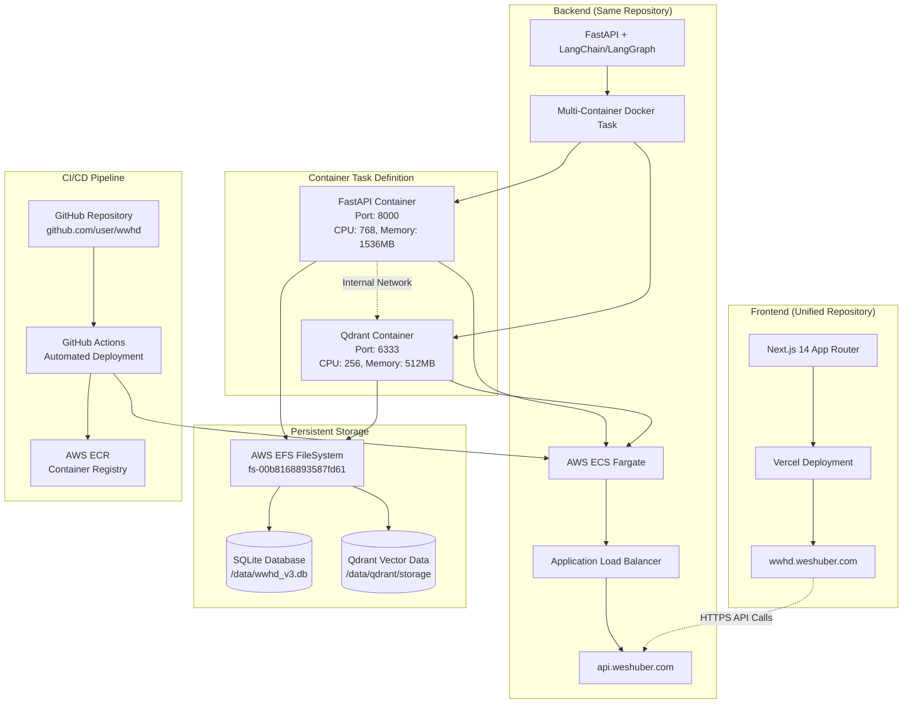

# 🚀 WWHD Deployment Guide

## 📋 Current Architecture - Unified Repository Deployment

### Implementation: ECS Fargate + Vercel (Updated November 2024)



**Deployment Steps**:

```bash
# Day 1: Infrastructure
1. Set up AWS account
2. Configure Route53 domain
3. Create S3 bucket for frontend
4. Set up CloudFront distribution
5. Launch Qdrant Cloud instance
6. Configure Secrets Manager

# Day 2: Application
1. Build Docker container
2. Deploy to App Runner
3. Deploy frontend to S3
4. Configure environment variables
5. Run smoke tests
6. Enable monitoring
```

### ECS Fargate Configuration (Current Implementation)

```yaml
infrastructure:
  compute:
    type: ECS Fargate
    cpu: 2 vCPU
    memory: 4 GB
    auto_scaling:
      min: 2
      max: 10
      target_cpu: 70%

  load_balancer:
    type: Application Load Balancer
    listeners:
      - port: 443
        protocol: HTTPS
        certificate: ACM

  database:
    development: SQLite on EFS
    production: RDS PostgreSQL

  vector_db:
    option_1: Qdrant Cloud
    option_2: Self-hosted Qdrant on ECS
```

## Infrastructure Setup

### ECS Fargate Setup Scripts (Current Implementation)

```bash
#!/bin/bash
# infrastructure/scripts/setup-ecs.sh

# Create ECS cluster
aws ecs create-cluster --cluster-name wwhd-cluster

# Create EFS file system for persistent storage
aws efs create-file-system --tags Key=Name,Value=wwhd-efs

# Create security groups
aws ec2 create-security-group \
  --group-name wwhd-sg \
  --description "Security group for WWHD application"

# Create Application Load Balancer
aws elbv2 create-load-balancer \
  --name wwhd-alb \
  --subnets subnet-xxx subnet-yyy \
  --security-groups sg-xxx

# Create ECS task definition
aws ecs register-task-definition \
  --cli-input-json file://infrastructure/task-definition.json

# Create ECS service
aws ecs create-service \
  --cluster wwhd-cluster \
  --service-name wwhd-service \
  --task-definition wwhd-task \
  --desired-count 2
```

### AWS Amplify Setup (Frontend Repository)

```bash
# In wwhd-frontend repository
npm install -g @aws-amplify/cli
amplify init
amplify add hosting
amplify publish
```

## Docker Configuration

### Backend Dockerfile

```dockerfile
FROM python:3.11-slim

WORKDIR /app

# Install dependencies
COPY requirements.txt .
RUN pip install --no-cache-dir -r requirements.txt

# Copy application
COPY . .

# Health check
HEALTHCHECK --interval=30s --timeout=3s --start-period=5s --retries=3 \
  CMD curl -f http://localhost:8000/health || exit 1

# Run application
CMD ["uvicorn", "main:app", "--host", "0.0.0.0", "--port", "8000"]
```

### Docker Compose (Development)

```yaml
version: '3.8'

services:
  backend:
    build: ./backend
    ports:
      - "8000:8000"
    environment:
      - DATABASE_URL=sqlite:///./data/app.db
      - QDRANT_URL=http://qdrant:6333
    volumes:
      - ./data:/app/data
    depends_on:
      - qdrant

  qdrant:
    image: qdrant/qdrant
    ports:
      - "6333:6333"
    volumes:
      - qdrant_storage:/qdrant/storage

  frontend:
    build: ./frontend
    ports:
      - "3000:3000"
    environment:
      - NEXT_PUBLIC_API_URL=http://localhost:8000

volumes:
  qdrant_storage:
```

## 🔄 GitHub Actions CI/CD Pipeline

### Automated Backend Deployment

**Workflow File:** `backend/.github/workflows/deploy-backend.yml`

**Key Features:**
- 🧪 **Comprehensive Testing:** Container startup, health checks, API validation
- 🏗️ **Multi-Platform Builds:** AMD64 architecture for AWS Fargate
- 🔒 **OIDC Security:** No long-lived AWS credentials
- 📊 **Rich Monitoring:** Deployment summaries and service status
- ⚡ **Fast Feedback:** Parallel testing and deployment steps

**Trigger Conditions:**
```yaml
on:
  push:
    branches: [master]
    paths:
      - 'backend/**'
      - '.github/workflows/deploy-backend.yml'
  workflow_dispatch:  # Manual deployment with environment selection
```

**Deployment Pipeline:**
1. **📥 Code Checkout** → Repository clone
2. **🧪 Docker Testing** → Container build and health validation
3. **🔑 AWS Authentication** → OIDC-based credential exchange
4. **🏗️ Multi-Platform Build** → AMD64 container for Fargate
5. **📤 ECR Push** → Container registry upload
6. **⚙️ Task Definition Update** → Environment variables injection
7. **🚀 ECS Deployment** → Rolling update with zero downtime
8. **✅ Production Verification** → Health checks and service stability

**Example Deployment Flow:**
```bash
# Automatic deployment on push to master
git push origin master

# Manual deployment with environment selection
# Use GitHub UI → Actions → Deploy Backend → Run workflow
```

### Frontend Deployment (Vercel)

**Current Setup:**
- **Platform:** Vercel (automatic deployment)
- **Trigger:** Push to `master` branch
- **Domain:** https://wwhd.weshuber.com
- **Build Command:** `cd frontend && npm run build`
- **Output Directory:** `frontend/.next`

**Vercel Configuration:**
```json
{
  "builds": [
    {
      "src": "frontend/package.json",
      "use": "@vercel/next"
    }
  ],
  "routes": [
    {
      "src": "/api/(.*)",
      "dest": "https://api.weshuber.com/api/v1/$1"
    }
  ]
}
```

## Environment Configuration

### Production Environment Variables

**Current Production Configuration:**
```bash
# Application Core
APP_ENV=production
LOG_LEVEL=INFO

# AI/ML Configuration
OPENAI_API_KEY=sk-...                    # From GitHub Secrets
MODEL_CHAT=gpt-4o-mini                   # From GitHub Variables
MODEL_EMBED=text-embedding-3-small      # From GitHub Variables
ENABLE_OPENAI=true

# Database Configuration
DATABASE_URL=sqlite:////data/app.db
SQLITE_PATH=/data/wwhd_v3.db            # EFS mount path

# Vector Database (Self-hosted Qdrant)
QDRANT_URL=http://localhost:6333        # Internal container network

# Security & Authentication
JWT_SECRET=${GITHUB_SECRETS}            # Secure random string
CORS_ORIGINS=["https://wwhd.weshuber.com", "https://api.weshuber.com"]

# Infrastructure
CONTAINER_PORT=8000
QDRANT_PORT=6333
```

**GitHub Repository Configuration:**

**Secrets (Encrypted):**
- `AWS_ROLE_ARN`: IAM role for OIDC authentication
- `OPENAI_API_KEY`: OpenAI API access key
- `JWT_SECRET`: JWT signing secret

**Variables (Environment-specific):**
- `MODEL_CHAT`: Chat completion model name
- `MODEL_EMBED`: Text embedding model name
- `CORS_ORIGINS`: Allowed frontend origins

**Development Environment:**
```bash
# Local development override
APP_ENV=development
LOG_LEVEL=DEBUG
DATABASE_URL=sqlite:///./dev_app.db
QDRANT_URL=http://localhost:6333
CORS_ORIGINS=["http://localhost:3000", "http://localhost:3001"]
```

## Monitoring Setup

## 📊 Monitoring & Observability

### CloudWatch Logging

**Log Groups:**
- `/ecs/wwhd-backend` - Main application logs
- `/ecs/wwhd-backend/fastapi` - FastAPI container logs
- `/ecs/wwhd-backend/qdrant` - Qdrant database logs

**Real-time Monitoring Commands:**
```bash
# Monitor all backend logs
aws logs tail /ecs/wwhd-backend --region us-west-2 --follow

# Filter for errors only
aws logs tail /ecs/wwhd-backend --region us-west-2 --follow | grep ERROR

# Monitor RAG pipeline activity
aws logs tail /ecs/wwhd-backend --region us-west-2 --follow | grep -E "(RAG|retrieval|generation)"

# Check deployment events
aws logs tail /ecs/wwhd-backend --region us-west-2 --since 10m | grep -E "(🚀|✅|❌)"
```

### Health Monitoring

**Endpoints:**
- **Backend Health:** https://api.weshuber.com/health
- **Detailed Status:** https://api.weshuber.com/api/v1/health
- **Frontend Status:** https://wwhd.weshuber.com

**ECS Service Monitoring:**
```bash
# Check service status
aws ecs describe-services --cluster wwhd-cluster --services wwhd-backend --region us-west-2

# Monitor task health
aws ecs list-tasks --cluster wwhd-cluster --service-name wwhd-backend --region us-west-2

# Check deployment events
aws ecs describe-services --cluster wwhd-cluster --services wwhd-backend \
  --query 'services[0].events[:5]' --region us-west-2
```

### Performance Metrics

**Key Performance Indicators:**
- **Response Time:** < 2 seconds for chat completions
- **Retrieval Accuracy:** Vector similarity scores > 0.6
- **System Uptime:** 99.9% availability target
- **Error Rate:** < 1% of total requests

**Resource Utilization:**
- **CPU Usage:** Target < 70% average
- **Memory Usage:** Target < 80% of allocated
- **EFS Storage:** Monitor growth trends
- **Container Restart Count:** Should be minimal

## Cost Optimization

### Resource Allocation by Environment

| Component | Dev | Staging | Production |
|-----------|-----|---------|------------|
| ECS Fargate | 1 vCPU, 2GB | 2 vCPU, 4GB | 4 vCPU, 8GB |
| Qdrant (Self-hosted) | 1 vCPU, 2GB | 2 vCPU, 4GB | 4 vCPU, 8GB |
| Database | SQLite on EFS | SQLite on EFS | SQLite on EFS |
| Frontend | Amplify Free | Amplify | Amplify |

### Estimated Monthly Costs

```yaml
development:
  total: $30
  breakdown:
    ecs_fargate: $20
    amplify: $0 (free tier)
    efs_storage: $5
    alb: $5

production:
  total: $200
  breakdown:
    ecs_fargate: $150  # With auto-scaling
    amplify: $15
    efs_storage: $10
    alb: $20
    monitoring: $5
```

## Deployment Checklist

### Day 1: Infrastructure

- [ ] AWS account setup
- [ ] IAM roles and policies
- [ ] VPC and networking (if ECS)
- [ ] Secrets Manager configuration
- [ ] S3 buckets creation
- [ ] CloudFront distribution
- [ ] Route53 DNS setup
- [ ] ACM SSL certificates

### Day 2: Application

- [ ] ECR repository setup
- [ ] Docker image build
- [ ] ECS Fargate deployment
- [ ] Amplify frontend setup (separate repo)
- [ ] Environment variables
- [ ] Database migrations
- [ ] Qdrant collections setup
- [ ] Frontend deployment
- [ ] Health check validation
- [ ] Smoke tests
- [ ] Monitoring alerts

## Rollback Strategy

```bash
# ECS Fargate rollback
aws ecs update-service \
  --cluster wwhd-cluster \
  --service wwhd-service \
  --task-definition wwhd-task:PREVIOUS_REVISION

# Amplify rollback (in frontend repository)
amplify console
# Use Amplify console to rollback to previous deployment
```

## Acceptance Criteria

- ✅ Zero-downtime deployments
- ✅ Automated CI/CD pipeline
- ✅ Infrastructure as Code
- ✅ Secrets properly managed
- ✅ Monitoring and alerts configured
- ✅ Backup and rollback procedures
- ✅ Cost tracking enabled
- ✅ Auto-scaling configured