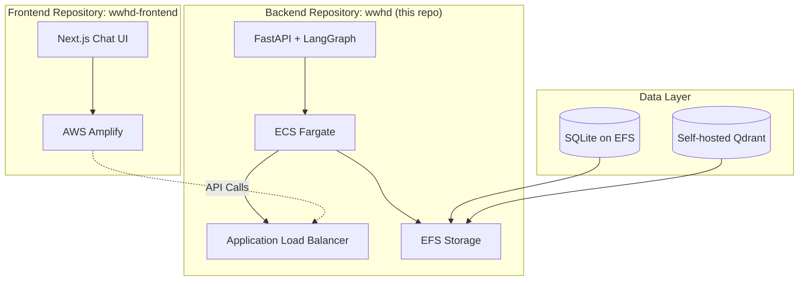

# Deployment

## AWS Architecture - Multi-Repository Deployment

### Current Implementation: ECS Fargate + AWS Amplify



**Deployment Steps**:

```bash
# Day 1: Infrastructure
1. Set up AWS account
2. Configure Route53 domain
3. Create S3 bucket for frontend
4. Set up CloudFront distribution
5. Launch Qdrant Cloud instance
6. Configure Secrets Manager

# Day 2: Application
1. Build Docker container
2. Deploy to App Runner
3. Deploy frontend to S3
4. Configure environment variables
5. Run smoke tests
6. Enable monitoring
```

### ECS Fargate Configuration (Current Implementation)

```yaml
infrastructure:
  compute:
    type: ECS Fargate
    cpu: 2 vCPU
    memory: 4 GB
    auto_scaling:
      min: 2
      max: 10
      target_cpu: 70%

  load_balancer:
    type: Application Load Balancer
    listeners:
      - port: 443
        protocol: HTTPS
        certificate: ACM

  database:
    development: SQLite on EFS
    production: RDS PostgreSQL

  vector_db:
    option_1: Qdrant Cloud
    option_2: Self-hosted Qdrant on ECS
```

## Infrastructure Setup

### ECS Fargate Setup Scripts (Current Implementation)

```bash
#!/bin/bash
# infrastructure/scripts/setup-ecs.sh

# Create ECS cluster
aws ecs create-cluster --cluster-name wwhd-cluster

# Create EFS file system for persistent storage
aws efs create-file-system --tags Key=Name,Value=wwhd-efs

# Create security groups
aws ec2 create-security-group \
  --group-name wwhd-sg \
  --description "Security group for WWHD application"

# Create Application Load Balancer
aws elbv2 create-load-balancer \
  --name wwhd-alb \
  --subnets subnet-xxx subnet-yyy \
  --security-groups sg-xxx

# Create ECS task definition
aws ecs register-task-definition \
  --cli-input-json file://infrastructure/task-definition.json

# Create ECS service
aws ecs create-service \
  --cluster wwhd-cluster \
  --service-name wwhd-service \
  --task-definition wwhd-task \
  --desired-count 2
```

### AWS Amplify Setup (Frontend Repository)

```bash
# In wwhd-frontend repository
npm install -g @aws-amplify/cli
amplify init
amplify add hosting
amplify publish
```

## Docker Configuration

### Backend Dockerfile

```dockerfile
FROM python:3.11-slim

WORKDIR /app

# Install dependencies
COPY requirements.txt .
RUN pip install --no-cache-dir -r requirements.txt

# Copy application
COPY . .

# Health check
HEALTHCHECK --interval=30s --timeout=3s --start-period=5s --retries=3 \
  CMD curl -f http://localhost:8000/health || exit 1

# Run application
CMD ["uvicorn", "main:app", "--host", "0.0.0.0", "--port", "8000"]
```

### Docker Compose (Development)

```yaml
version: '3.8'

services:
  backend:
    build: ./backend
    ports:
      - "8000:8000"
    environment:
      - DATABASE_URL=sqlite:///./data/app.db
      - QDRANT_URL=http://qdrant:6333
    volumes:
      - ./data:/app/data
    depends_on:
      - qdrant

  qdrant:
    image: qdrant/qdrant
    ports:
      - "6333:6333"
    volumes:
      - qdrant_storage:/qdrant/storage

  frontend:
    build: ./frontend
    ports:
      - "3000:3000"
    environment:
      - NEXT_PUBLIC_API_URL=http://localhost:8000

volumes:
  qdrant_storage:
```

## GitHub Actions CI/CD

```yaml
# .github/workflows/deploy.yml
name: Deploy to AWS

on:
  push:
    branches: [main]

jobs:
  test:
    runs-on: ubuntu-latest
    steps:
      - uses: actions/checkout@v3
      - name: Run tests
        run: |
          pip install -r requirements.txt
          pytest

  deploy-backend:
    needs: test
    runs-on: ubuntu-latest
    steps:
      - uses: actions/checkout@v3

      - name: Configure AWS credentials
        uses: aws-actions/configure-aws-credentials@v2
        with:
          aws-access-key-id: ${{ secrets.AWS_ACCESS_KEY_ID }}
          aws-secret-access-key: ${{ secrets.AWS_SECRET_ACCESS_KEY }}
          aws-region: us-west-2

      - name: Build and push Docker image
        run: |
          aws ecr get-login-password | docker login --username AWS --password-stdin $ECR_REGISTRY
          docker build -t $ECR_REPOSITORY:latest ./backend
          docker push $ECR_REPOSITORY:latest

      - name: Deploy to ECS
        run: |
          aws ecs update-service \
            --cluster wwhd-cluster \
            --service wwhd-service \
            --force-new-deployment

  deploy-frontend:
    needs: test
    runs-on: ubuntu-latest
    steps:
      - uses: actions/checkout@v3

      - name: Build frontend
        run: |
          cd frontend
          npm install
          npm run build

      - name: Deploy to S3
        run: |
          # Frontend deployment handled by separate wwhd-frontend repository
          # using AWS Amplify automatic deployments
          echo "Frontend deployed via AWS Amplify in separate repository"
```

## Environment Configuration

### Production Environment Variables

```bash
# API Server
APP_ENV=production
LOG_LEVEL=INFO

# LLM Configuration
OPENAI_API_KEY=${SECRETS_MANAGER:openai_key}
MODEL_CHAT=gpt-4o-mini
MODEL_EMBED=text-embedding-3-small

# Vector Database (Self-hosted)
QDRANT_URL=http://localhost:6333
QDRANT_API_KEY=

# Database (SQLite on EFS)
DATABASE_URL=sqlite:///./data/app.db

# Authentication
JWT_SECRET=${SECRETS_MANAGER:jwt_secret}
JWT_ISSUER=wwhd
JWT_AUDIENCE=wwhd-users

# CORS (Amplify frontend)
ALLOW_ORIGINS=https://wwhd.amplifyapp.com,http://localhost:3000
```

## Monitoring Setup

### CloudWatch Configuration

```yaml
metrics:
  - name: RequestLatency
    namespace: WWHD/API
    dimensions:
      - Environment
      - Endpoint

  - name: TokenUsage
    namespace: WWHD/Usage
    dimensions:
      - User
      - Model

alarms:
  - name: HighLatency
    metric: RequestLatency
    threshold: 5000  # 5 seconds
    comparison: GreaterThanThreshold

  - name: HighErrorRate
    metric: 4xxErrors
    threshold: 10
    comparison: GreaterThanThreshold
```

## Cost Optimization

### Resource Allocation by Environment

| Component | Dev | Staging | Production |
|-----------|-----|---------|------------|
| ECS Fargate | 1 vCPU, 2GB | 2 vCPU, 4GB | 4 vCPU, 8GB |
| Qdrant (Self-hosted) | 1 vCPU, 2GB | 2 vCPU, 4GB | 4 vCPU, 8GB |
| Database | SQLite on EFS | SQLite on EFS | SQLite on EFS |
| Frontend | Amplify Free | Amplify | Amplify |

### Estimated Monthly Costs

```yaml
development:
  total: $30
  breakdown:
    ecs_fargate: $20
    amplify: $0 (free tier)
    efs_storage: $5
    alb: $5

production:
  total: $200
  breakdown:
    ecs_fargate: $150  # With auto-scaling
    amplify: $15
    efs_storage: $10
    alb: $20
    monitoring: $5
```

## Deployment Checklist

### Day 1: Infrastructure

- [ ] AWS account setup
- [ ] IAM roles and policies
- [ ] VPC and networking (if ECS)
- [ ] Secrets Manager configuration
- [ ] S3 buckets creation
- [ ] CloudFront distribution
- [ ] Route53 DNS setup
- [ ] ACM SSL certificates

### Day 2: Application

- [ ] ECR repository setup
- [ ] Docker image build
- [ ] ECS Fargate deployment
- [ ] Amplify frontend setup (separate repo)
- [ ] Environment variables
- [ ] Database migrations
- [ ] Qdrant collections setup
- [ ] Frontend deployment
- [ ] Health check validation
- [ ] Smoke tests
- [ ] Monitoring alerts

## Rollback Strategy

```bash
# ECS Fargate rollback
aws ecs update-service \
  --cluster wwhd-cluster \
  --service wwhd-service \
  --task-definition wwhd-task:PREVIOUS_REVISION

# Amplify rollback (in frontend repository)
amplify console
# Use Amplify console to rollback to previous deployment
```

## Acceptance Criteria

- ✅ Zero-downtime deployments
- ✅ Automated CI/CD pipeline
- ✅ Infrastructure as Code
- ✅ Secrets properly managed
- ✅ Monitoring and alerts configured
- ✅ Backup and rollback procedures
- ✅ Cost tracking enabled
- ✅ Auto-scaling configured