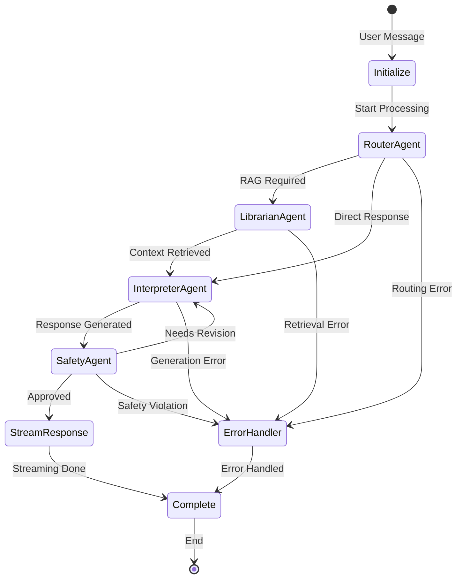

# Multi-Agent System

## Overview

W.W.H.D. uses LangGraph to orchestrate a sophisticated multi-agent workflow where specialized agents handle different aspects of processing user queries. Each agent is a node in a state machine with defined responsibilities, transitions, and error handling.

## Agent Architecture

### State Machine Design



## Agent Specifications

### 1. RouterAgent

**Purpose**: Intelligent intent classification and routing decisions

**Responsibilities:**
- Analyze user message intent
- Select appropriate knowledge namespaces
- Determine agent execution path
- Calculate confidence scores

**Implementation:**

```python
class RouterAgent:
    """
    Routes user messages to appropriate downstream agents based on intent.
    """

    def __init__(self, llm: ChatOpenAI):
        self.llm = llm
        self.namespace_map = {
            "relationships": ["dating", "marriage", "family", "friendship"],
            "money": ["investing", "wealth", "finance", "budgeting"],
            "business": ["entrepreneurship", "startup", "leadership"],
            "feng_shui": ["energy", "harmony", "space", "arrangement"],
            "diet_food": ["nutrition", "health", "cooking", "TCM"],
            "exercise_martial_arts": ["fitness", "shaolin", "kungfu"],
            "meditation": ["mindfulness", "breathing", "zen", "peace"],
            "general": []  # Fallback namespace
        }

    async def route(self, state: ConversationState) -> ConversationState:
        """
        Classify intent and select namespaces for retrieval.
        """
        # Build classification prompt
        prompt = ChatPromptTemplate.from_messages([
            ("system", ROUTER_SYSTEM_PROMPT),
            ("human", "{message}")
        ])

        # Get classification
        response = await self.llm.ainvoke(
            prompt.format(message=state.user_message)
        )

        # Parse response
        intent_data = self._parse_classification(response.content)

        # Update state
        state.intent = intent_data["intent"]
        state.confidence = intent_data["confidence"]
        state.selected_namespaces = intent_data["namespaces"]

        # Determine next node
        if state.selected_namespaces:
            state.next_node = "librarian"
        else:
            state.next_node = "interpreter"

        return state
```

**Routing Rules:**

```python
ROUTING_CONFIG = {
    "confidence_threshold": 0.7,
    "max_namespaces": 3,
    "fallback_namespace": "general",
    "multi_namespace_triggers": [
        "holistic", "balance", "lifestyle", "wellness"
    ],
    "direct_response_intents": [
        "greeting", "goodbye", "thanks", "clarification"
    ]
}
```

### 2. LibrarianAgent

**Purpose**: Hybrid retrieval and knowledge management

**Responsibilities:**
- Vector similarity search
- Keyword filtering
- Result reranking
- Source attribution

**Implementation:**

```python
class LibrarianAgent:
    """
    Performs retrieval-augmented generation from vector database.
    """

    def __init__(
        self,
        qdrant_client: QdrantClient,
        embedder: OpenAIEmbeddings,
        reranker: Optional[CrossEncoderReranker] = None
    ):
        self.qdrant = qdrant_client
        self.embedder = embedder
        self.reranker = reranker

    async def retrieve(self, state: ConversationState) -> ConversationState:
        """
        Retrieve relevant context from vector store.
        """
        # Generate query embedding
        query_vector = await self.embedder.aembed_query(
            state.user_message
        )

        # Search across selected namespaces
        all_results = []
        for namespace in state.selected_namespaces:
            results = await self._vector_search(
                query_vector=query_vector,
                namespace=namespace,
                limit=10
            )
            all_results.extend(results)

        # Optional reranking
        if self.reranker and len(all_results) > 10:
            all_results = await self._rerank_results(
                query=state.user_message,
                results=all_results
            )

        # Format for context
        state.retrieved_chunks = self._format_chunks(all_results[:5])
        state.citations = self._extract_citations(all_results[:3])

        state.next_node = "interpreter"
        return state

    async def _vector_search(
        self,
        query_vector: List[float],
        namespace: str,
        limit: int
    ) -> List[dict]:
        """
        Perform vector similarity search in specific namespace.
        """
        search_result = self.qdrant.search(
            collection_name="wwhd_knowledge",
            query_vector=query_vector,
            query_filter=Filter(
                must=[
                    FieldCondition(
                        key="namespace",
                        match=MatchValue(value=namespace)
                    )
                ]
            ),
            limit=limit
        )

        return [
            {
                "text": hit.payload["text"],
                "metadata": hit.payload["metadata"],
                "score": hit.score
            }
            for hit in search_result
        ]
```

**Retrieval Strategies:**

| Strategy | Use Case | Implementation |
|----------|----------|----------------|
| Semantic Search | General queries | Cosine similarity |
| Hybrid Search | Specific terms | Semantic + BM25 |
| Filtered Search | Category-specific | Metadata filtering |
| Multi-namespace | Broad topics | Union of results |

### 3. InterpreterAgent

**Purpose**: Response generation with personality and context

**Responsibilities:**
- Prompt engineering
- Response generation
- Token streaming
- Format control

**Implementation:**

```python
class InterpreterAgent:
    """
    Generates responses using LLM with Herman's personality.
    """

    def __init__(self, llm: ChatOpenAI):
        self.llm = llm
        self.system_prompt = HERMAN_SYSTEM_PROMPT

    async def generate(self, state: ConversationState) -> ConversationState:
        """
        Generate response with context and personality.
        """
        # Build context-aware prompt
        messages = self._build_messages(state)

        # Stream response
        response_chunks = []
        async for chunk in self.llm.astream(messages):
            if chunk.content:
                response_chunks.append(chunk.content)
                # Stream to client via SSE
                await self._stream_chunk(chunk.content)

        # Combine response
        state.final_response = "".join(response_chunks)
        state.response_tokens = response_chunks

        # Update token counts
        state.completion_tokens = self._count_tokens(state.final_response)

        state.next_node = "safety"
        return state

    def _build_messages(self, state: ConversationState) -> List[dict]:
        """
        Construct message history with context.
        """
        messages = [
            {"role": "system", "content": self.system_prompt}
        ]

        # Add retrieved context if available
        if state.retrieved_chunks:
            context = self._format_context(state.retrieved_chunks)
            messages.append({
                "role": "system",
                "content": f"Relevant context:\n{context}"
            })

        # Add conversation history
        for msg in state.message_history[-5:]:
            messages.append({
                "role": msg["role"],
                "content": msg["content"]
            })

        # Add current query
        messages.append({
            "role": "user",
            "content": state.user_message
        })

        return messages
```

**Response Templates:**

```python
RESPONSE_TEMPLATES = {
    "meditation": """
        Guide the user through {technique} meditation.
        Include: breathing instructions, posture, mental focus.
        Duration: {duration} minutes.
    """,

    "feng_shui": """
        Analyze the {space} using feng shui principles.
        Consider: five elements, bagua map, chi flow.
        Provide: specific recommendations.
    """,

    "relationships": """
        Address {issue} with wisdom and compassion.
        Draw from: Shaolin teachings, psychology, experience.
        Tone: supportive, non-judgmental.
    """
}
```

### 4. SafetyAgent

**Purpose**: Content moderation and safety checks

**Responsibilities:**
- Harmful content detection
- PII filtering
- Compliance checking
- Response modification

**Implementation:**

```python
class SafetyAgent:
    """
    Ensures responses meet safety and ethical guidelines.
    """

    def __init__(self, moderation_client: OpenAIModerationClient):
        self.moderator = moderation_client
        self.safety_rules = SAFETY_RULES

    async def check_safety(self, state: ConversationState) -> ConversationState:
        """
        Validate response safety and compliance.
        """
        # Check for harmful content
        moderation_result = await self.moderator.check(
            state.final_response
        )

        if moderation_result.flagged:
            state.safety_flags = moderation_result.categories

            # Attempt to revise
            if self._can_revise(moderation_result):
                state.next_node = "interpreter"
                state.safety_revision_needed = True
            else:
                # Block entirely
                state.final_response = SAFETY_BLOCKED_MESSAGE
                state.next_node = "complete"
        else:
            # Add disclaimers if needed
            state.final_response = self._add_disclaimers(
                state.final_response,
                state.intent
            )
            state.next_node = "complete"

        return state

    def _add_disclaimers(self, response: str, intent: str) -> str:
        """
        Add appropriate disclaimers based on content type.
        """
        disclaimers = {
            "health": "\n\n*This is not medical advice. Consult healthcare professionals for medical concerns.*",
            "financial": "\n\n*This is not financial advice. Consult qualified advisors for investment decisions.*",
            "legal": "\n\n*This is not legal advice. Consult attorneys for legal matters.*"
        }

        for trigger, disclaimer in disclaimers.items():
            if trigger in intent.lower():
                response += disclaimer
                break

        return response
```

**Safety Rules:**

```yaml
safety_rules:
  blocked_topics:
    - self_harm
    - violence
    - illegal_activities
    - hate_speech

  sensitive_topics:
    - medical_diagnosis
    - financial_advice
    - legal_counsel
    - psychological_therapy

  required_disclaimers:
    health: "Not medical advice"
    finance: "Not financial advice"
    legal: "Not legal advice"

  pii_patterns:
    - ssn: '\d{3}-\d{2}-\d{4}'
    - credit_card: '\d{4}[\s-]?\d{4}[\s-]?\d{4}[\s-]?\d{4}'
    - email: '[\w\.-]+@[\w\.-]+\.\w+'
```

## State Management

### Conversation State Schema

```python
from typing import TypedDict, List, Optional, Literal
from datetime import datetime

class ConversationState(TypedDict):
    """
    Complete state for conversation processing.
    """
    # Message Context
    user_id: str
    session_id: str
    message_id: str
    user_message: str
    message_history: List[dict]
    timestamp: datetime

    # Routing
    intent: Optional[str]
    confidence: float
    selected_namespaces: List[str]
    selected_agents: List[str]

    # RAG Context
    retrieved_chunks: List[dict]
    reranked_chunks: Optional[List[dict]]
    citations: List[dict]

    # Generation
    system_prompt: str
    final_response: str
    response_tokens: List[str]
    stream_chunks: List[str]

    # Safety
    safety_flags: List[str]
    safety_revision_needed: bool
    disclaimers_added: List[str]

    # Accounting
    prompt_tokens: int
    completion_tokens: int
    embedding_tokens: int
    total_tokens: int
    estimated_cost: float

    # Control Flow
    current_node: str
    next_node: Optional[str]
    visited_nodes: List[str]
    error: Optional[str]
    status: Literal["processing", "streaming", "complete", "error"]
```

### State Transitions

```python
STATE_TRANSITIONS = {
    "initialize": ["router"],
    "router": ["librarian", "interpreter", "error"],
    "librarian": ["interpreter", "error"],
    "interpreter": ["safety", "error"],
    "safety": ["complete", "interpreter", "error"],
    "error": ["complete"],
    "complete": []
}

def validate_transition(current: str, next: str) -> bool:
    """
    Validate state transition is allowed.
    """
    return next in STATE_TRANSITIONS.get(current, [])
```

## Error Handling

### Error Recovery Strategies

| Error Type | Recovery Strategy | Fallback |
|------------|------------------|----------|
| LLM Timeout | Retry with exponential backoff | Generic response |
| Vector DB Error | Serve from cache | Direct generation |
| Rate Limit | Queue and retry | Apologetic message |
| Invalid State | Reset to router | Error message |

### Error Handler Implementation

```python
class ErrorHandler:
    """
    Centralized error handling for agent pipeline.
    """

    async def handle_error(
        self,
        state: ConversationState,
        error: Exception
    ) -> ConversationState:
        """
        Process errors and determine recovery strategy.
        """
        error_type = type(error).__name__

        # Log error
        logger.error(f"Agent error: {error_type}", exc_info=error)

        # Determine recovery
        if isinstance(error, RateLimitError):
            state.final_response = RATE_LIMIT_MESSAGE
            state.status = "error"

        elif isinstance(error, TimeoutError):
            # Retry logic
            if state.get("retry_count", 0) < 3:
                state["retry_count"] = state.get("retry_count", 0) + 1
                state.next_node = state.current_node  # Retry same node
                return state
            else:
                state.final_response = TIMEOUT_MESSAGE

        elif isinstance(error, VectorDBError):
            # Skip RAG, go direct to generation
            state.next_node = "interpreter"
            state.selected_namespaces = []
            return state

        else:
            state.final_response = GENERIC_ERROR_MESSAGE

        state.status = "error"
        state.next_node = "complete"
        return state
```

## Performance Optimization

### Agent Parallelization

```python
async def parallel_agent_execution(state: ConversationState):
    """
    Execute independent agents in parallel.
    """
    tasks = []

    # Router and Safety can run in parallel
    if state.current_node == "initialize":
        tasks.append(router_agent.route(state))
        tasks.append(safety_agent.precheck(state))

    # Multiple namespace searches in parallel
    if state.current_node == "librarian":
        for namespace in state.selected_namespaces:
            tasks.append(
                librarian_agent.search_namespace(state, namespace)
            )

    results = await asyncio.gather(*tasks, return_exceptions=True)

    # Merge results back to state
    return merge_states(state, results)
```

### Caching Strategies

```python
CACHE_CONFIG = {
    "router": {
        "ttl": 3600,  # 1 hour
        "key": "intent:{message_hash}"
    },
    "librarian": {
        "ttl": 1800,  # 30 minutes
        "key": "retrieval:{query_hash}:{namespaces}"
    },
    "interpreter": {
        "ttl": 300,  # 5 minutes
        "key": "response:{context_hash}"
    }
}
```

## Monitoring & Metrics

### Agent Metrics

```yaml
agent_metrics:
  router:
    - classification_accuracy
    - confidence_distribution
    - namespace_selection_rate
    - routing_latency

  librarian:
    - retrieval_precision
    - retrieval_recall
    - reranking_effectiveness
    - search_latency

  interpreter:
    - response_quality_score
    - token_usage
    - generation_latency
    - streaming_performance

  safety:
    - intervention_rate
    - false_positive_rate
    - revision_success_rate
    - moderation_latency
```

### Agent Observability

```python
from opentelemetry import trace

tracer = trace.get_tracer(__name__)

class ObservableAgent:
    """
    Base class for agents with built-in observability.
    """

    @tracer.start_as_current_span("agent_execution")
    async def execute(self, state: ConversationState) -> ConversationState:
        span = trace.get_current_span()

        # Add attributes
        span.set_attribute("agent.name", self.__class__.__name__)
        span.set_attribute("user.id", state.user_id)
        span.set_attribute("session.id", state.session_id)

        try:
            # Execute agent logic
            result = await self.process(state)
            span.set_status(StatusCode.OK)
            return result

        except Exception as e:
            span.set_status(StatusCode.ERROR, str(e))
            span.record_exception(e)
            raise
```

---

*For implementation examples, see [Agent Implementation](https://github.com/wbaxterh/wwhd/tree/master/backend/agents)*