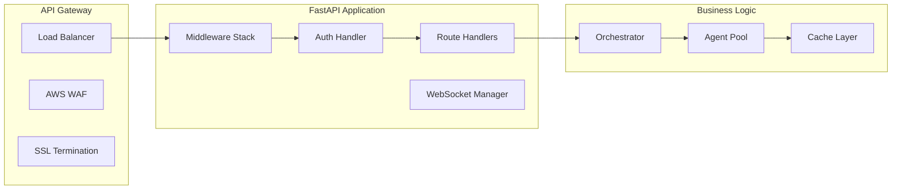
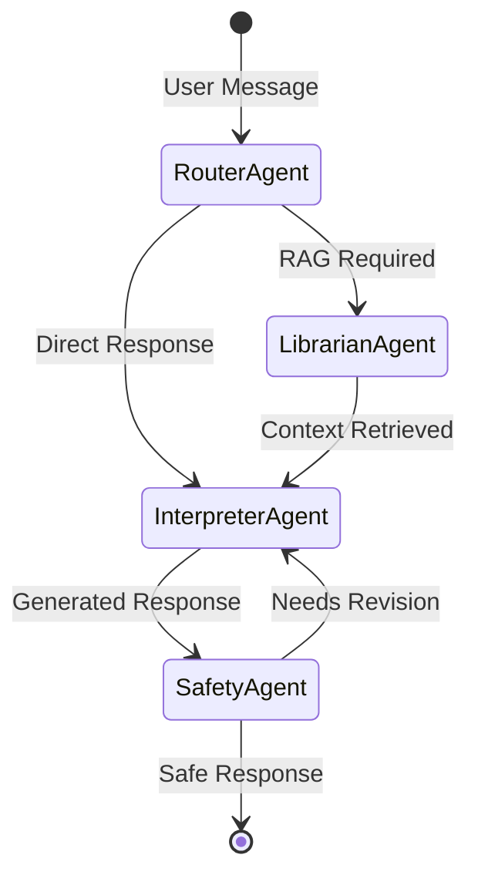
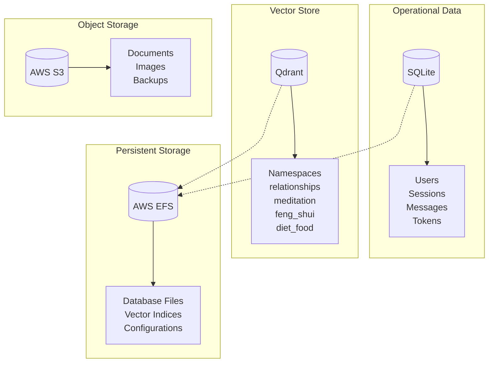
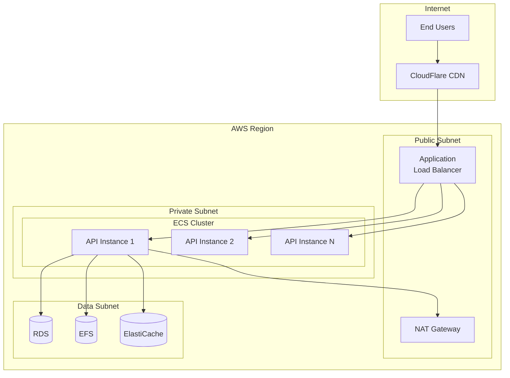
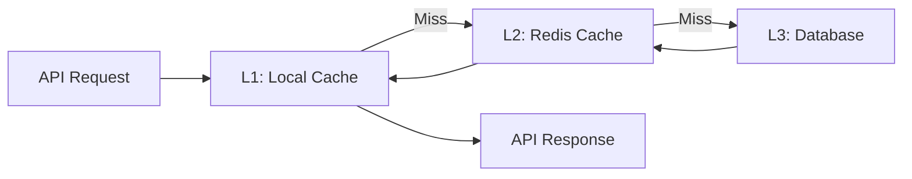
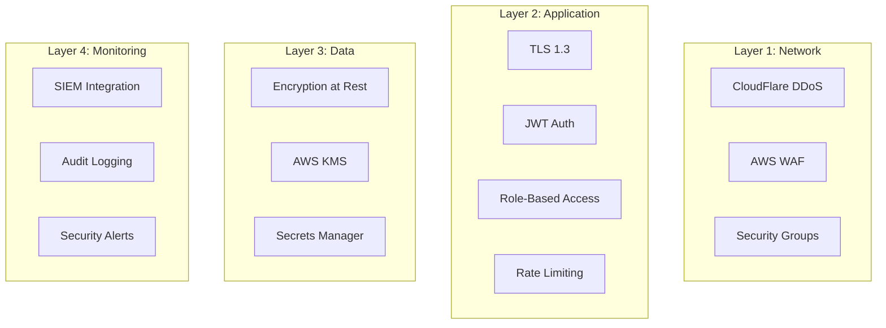
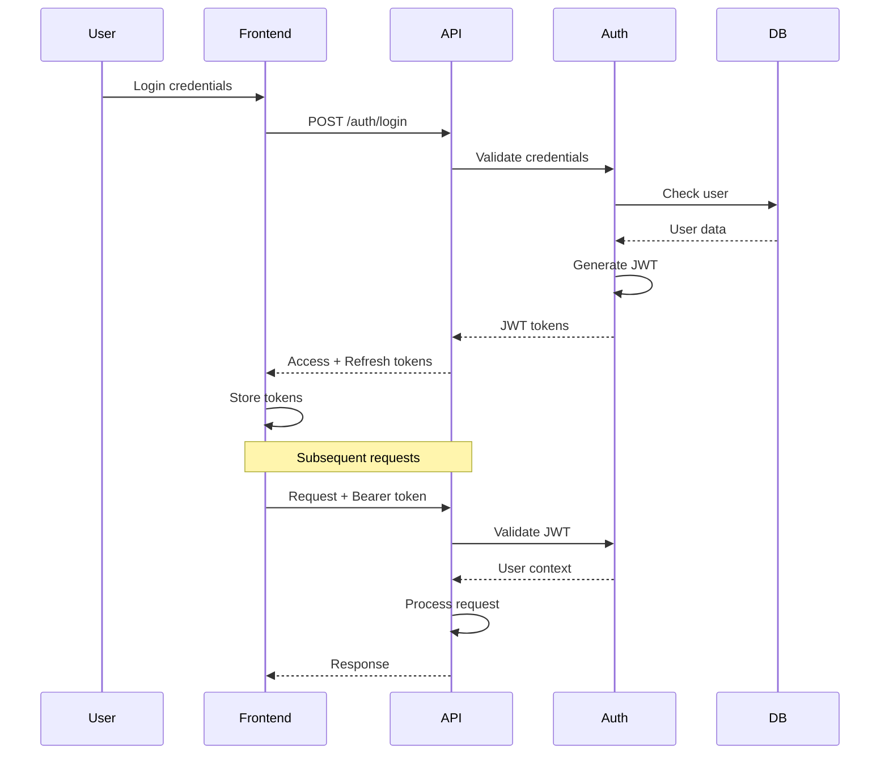
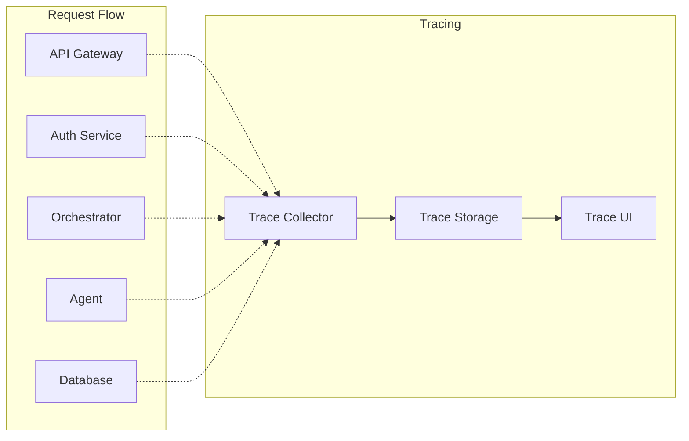

# System Design

## High-Level Architecture

W.W.H.D. follows a microservices-oriented architecture with clear separation of concerns between the presentation, business logic, and data layers. The system is designed for horizontal scalability, high availability, and maintainability.

## Architectural Principles

### 1. **Separation of Concerns**
- **Frontend**: Stateless React applications for web and mobile
- **Backend**: API server with agent orchestration logic
- **Data**: Separate stores for structured (SQLite) and vector (Qdrant) data

### 2. **Scalability First**
- Containerized services for easy scaling
- Stateless API design enabling horizontal scaling
- Auto-scaling based on CPU and memory metrics
- Load balancing across multiple instances

### 3. **Security by Design**
- Defense in depth with multiple security layers
- Zero-trust network architecture
- Encryption at rest and in transit
- Regular security audits and penetration testing

### 4. **Observability**
- Comprehensive logging at all layers
- Distributed tracing for request flows
- Real-time metrics and alerting
- Performance monitoring and optimization

## Component Architecture

### API Layer



**Key Components:**

- **Load Balancer**: Distributes traffic across multiple API instances
- **WAF**: Protects against common web exploits
- **Middleware**: Handles CORS, rate limiting, request logging
- **Auth Handler**: JWT validation and user context injection
- **Route Handlers**: RESTful endpoint implementations
- **Orchestrator**: LangGraph state machine coordination

### Agent Orchestration



**Agent Responsibilities:**

1. **RouterAgent**
   - Intent classification
   - Namespace selection
   - Routing decision making

2. **LibrarianAgent**
   - Vector similarity search
   - Hybrid retrieval strategies
   - Result reranking

3. **InterpreterAgent**
   - Prompt engineering
   - Response generation
   - Token streaming

4. **SafetyAgent**
   - Content filtering
   - PII detection
   - Compliance checking

### Data Architecture



**Storage Strategy:**

- **SQLite**: Transactional data, user management, chat history
- **Qdrant**: Vector embeddings, semantic search indices
- **S3**: Large objects, document storage, backups
- **EFS**: Shared persistent storage for containers

## Deployment Architecture

### Container Orchestration

```yaml
services:
  fastapi:
    image: wwhd-backend:latest
    cpu: 2048
    memory: 4096
    environment:
      - DATABASE_URL=sqlite:////data/app.db
      - QDRANT_URL=http://localhost:6333
      - OPENAI_API_KEY=${OPENAI_API_KEY}
    volumes:
      - efs:/data
    health_check:
      path: /health
      interval: 30s
    scaling:
      min: 2
      max: 10
      target_cpu: 70

  qdrant:
    image: qdrant/qdrant:latest
    cpu: 1024
    memory: 2048
    volumes:
      - efs:/qdrant/storage
    ports:
      - 6333:6333
```

### Network Architecture



## Scalability Patterns

### Horizontal Scaling

**API Tier:**
- Auto-scaling groups based on CPU/memory
- Target tracking scaling policies
- Warm pool for faster scaling

**Data Tier:**
- Read replicas for database
- Qdrant cluster mode for vector search
- Cache layer to reduce database load

### Vertical Scaling

**Model Selection:**
- Development: `gpt-4o-mini` (cost-effective)
- Production: `gpt-4o` (higher quality)
- Premium: `claude-3-opus` (best quality)

**Resource Allocation:**
```yaml
environments:
  development:
    api: { cpu: 512, memory: 1024 }
    qdrant: { cpu: 256, memory: 512 }

  staging:
    api: { cpu: 1024, memory: 2048 }
    qdrant: { cpu: 512, memory: 1024 }

  production:
    api: { cpu: 2048, memory: 4096 }
    qdrant: { cpu: 1024, memory: 2048 }
```

## Performance Optimization

### Caching Strategy



**Cache Levels:**
1. **L1 - Local Cache**: In-memory, 60s TTL
2. **L2 - Redis Cache**: Distributed, 5min TTL
3. **L3 - Database**: Persistent storage

### Query Optimization

**Vector Search:**
- Pre-filter by metadata before vector similarity
- Use HNSW index for fast approximate search
- Batch embedding generation
- Cache frequent query embeddings

**Database Queries:**
- Connection pooling
- Prepared statements
- Index optimization
- Query result caching

## Security Architecture

### Defense in Depth



### Authentication Flow



## Monitoring & Observability

### Metrics Collection

```yaml
infrastructure_metrics:
  - cpu_utilization
  - memory_usage
  - network_throughput
  - disk_iops
  - container_health

application_metrics:
  - request_rate
  - response_time_p50
  - response_time_p95
  - error_rate
  - active_sessions

business_metrics:
  - daily_active_users
  - messages_per_session
  - token_usage_per_user
  - namespace_hit_rates
  - user_retention

ai_metrics:
  - model_latency
  - embedding_generation_time
  - retrieval_precision
  - reranking_effectiveness
  - safety_intervention_rate
```

### Distributed Tracing



## Disaster Recovery

### Backup Strategy

| Component | Method | Frequency | Retention | RPO | RTO |
|-----------|--------|-----------|-----------|-----|-----|
| Database | Automated snapshots | Daily | 30 days | 24h | 1h |
| Qdrant | EFS snapshots | Daily | 7 days | 24h | 2h |
| Code | Git repository | On commit | Forever | 0 | 30m |
| Configs | Secrets backup | On change | 90 days | 1h | 30m |
| Documents | S3 versioning | Real-time | 30 days | 0 | 0 |

### Failure Scenarios

**Service Failures:**
1. **API Server**: Auto-scaling group launches replacement
2. **Database**: Failover to read replica
3. **Qdrant**: Serve from cache, degraded mode
4. **LLM Service**: Fallback to alternate provider

**Regional Failures:**
- Cross-region replication (planned)
- Multi-region active-passive setup
- DNS failover with Route53

## Cost Optimization

### Resource Right-Sizing

```yaml
cost_optimization:
  compute:
    - Use Spot instances for development
    - Reserved instances for production
    - Auto-scaling to match demand

  storage:
    - Lifecycle policies for S3
    - Compress vector indices
    - Purge old chat sessions

  ai_services:
    - Use gpt-4o-mini for routing
    - Cache embeddings aggressively
    - Batch API calls

  networking:
    - CloudFlare for CDN
    - Compress API responses
    - Connection pooling
```

### Cost Controls

- **Token Limits**: Max 4000 tokens per request
- **Rate Limiting**: Prevent abuse
- **User Quotas**: Daily token allowances
- **Model Routing**: Use cheaper models when possible

---

*For implementation details, see [Development Guide](../development/local-setup)*