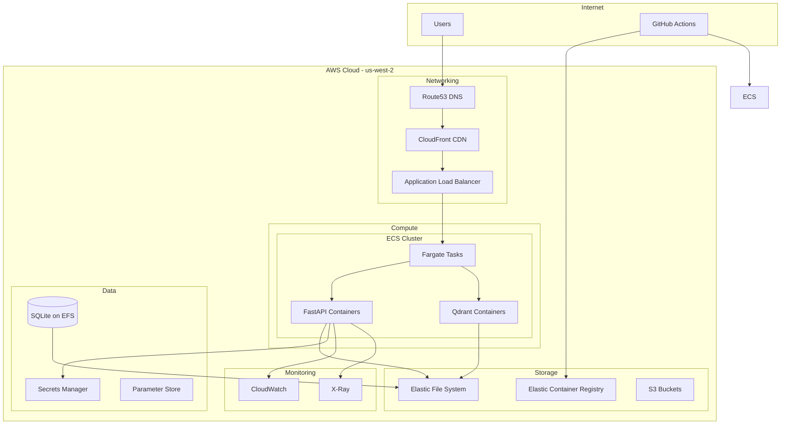

# AWS Infrastructure

## Infrastructure Overview

W.W.H.D. is deployed on AWS using a containerized architecture with ECS Fargate for serverless container orchestration. The infrastructure is designed for high availability, automatic scaling, and cost optimization.

## Architecture Diagram



## Core Services

### 1. ECS Fargate

**Configuration:**
```yaml
cluster:
  name: wwhd-cluster
  capacity_providers:
    - FARGATE
    - FARGATE_SPOT

service:
  name: wwhd-backend
  launch_type: FARGATE
  desired_count: 2
  deployment:
    minimum_healthy_percent: 100
    maximum_percent: 200
  network:
    subnets:
      - subnet-private-1a
      - subnet-private-1b
    security_groups:
      - sg-backend-api
  load_balancer:
    target_group: tg-wwhd-api
    container_name: fastapi
    container_port: 8000

task_definition:
  family: wwhd-backend
  cpu: 2048  # 2 vCPU
  memory: 4096  # 4 GB
  network_mode: awsvpc
  containers:
    - name: fastapi
      image: ${ECR_REGISTRY}/wwhd-backend:latest
      port_mappings:
        - container_port: 8000
          protocol: tcp
      environment:
        - name: APP_ENV
          value: production
        - name: DATABASE_URL
          value: sqlite:////data/app.db
        - name: QDRANT_URL
          value: http://localhost:6333
      secrets:
        - name: OPENAI_API_KEY
          value_from: arn:aws:secretsmanager:us-west-2:123456789:secret:openai-key
      mount_points:
        - source_volume: data-volume
          container_path: /data
      health_check:
        command: ["CMD-SHELL", "curl -f http://localhost:8000/health || exit 1"]
        interval: 30
        timeout: 5
        retries: 3

    - name: qdrant
      image: qdrant/qdrant:latest
      port_mappings:
        - container_port: 6333
          protocol: tcp
      mount_points:
        - source_volume: data-volume
          container_path: /qdrant/storage

  volumes:
    - name: data-volume
      efs_volume_configuration:
        file_system_id: fs-00b8168893587fd61
        transit_encryption: ENABLED
```

### 2. Application Load Balancer

**Configuration:**
```yaml
load_balancer:
  name: wwhd-alb
  type: application
  scheme: internet-facing
  subnets:
    - subnet-public-1a
    - subnet-public-1b
  security_groups:
    - sg-alb-public
  tags:
    Environment: production
    Service: wwhd

listeners:
  - port: 443
    protocol: HTTPS
    ssl_policy: ELBSecurityPolicy-TLS-1-2-2017-01
    certificate_arn: arn:aws:acm:us-west-2:123456789:certificate/abc
    default_action:
      type: forward
      target_group_arn: arn:aws:elasticloadbalancing:us-west-2:123456789:targetgroup/tg-wwhd-api

  - port: 80
    protocol: HTTP
    default_action:
      type: redirect
      redirect:
        protocol: HTTPS
        port: 443
        status_code: HTTP_301

target_group:
  name: tg-wwhd-api
  port: 8000
  protocol: HTTP
  vpc_id: vpc-abc123
  target_type: ip
  health_check:
    enabled: true
    path: /health
    protocol: HTTP
    healthy_threshold: 2
    unhealthy_threshold: 3
    timeout: 5
    interval: 30
    matcher: 200
```

### 3. Elastic File System (EFS)

**Configuration:**
```yaml
file_system:
  creation_token: wwhd-efs
  performance_mode: generalPurpose
  throughput_mode: bursting
  encrypted: true
  lifecycle_policy:
    transition_to_ia: AFTER_30_DAYS

mount_targets:
  - subnet_id: subnet-private-1a
    security_groups:
      - sg-efs-mount
  - subnet_id: subnet-private-1b
    security_groups:
      - sg-efs-mount

access_points:
  - path: /data
    posix_user:
      uid: 1000
      gid: 1000
    root_directory:
      path: /data
      creation_info:
        owner_uid: 1000
        owner_gid: 1000
        permissions: 755
```

## Auto-Scaling Configuration

### ECS Service Auto-Scaling

```yaml
scaling_policy:
  service_namespace: ecs
  resource_id: service/wwhd-cluster/wwhd-backend
  scalable_dimension: ecs:service:DesiredCount
  min_capacity: 2
  max_capacity: 10

target_tracking_policies:
  - name: cpu-scaling
    target_value: 70
    metric_type: ECSServiceAverageCPUUtilization
    scale_in_cooldown: 300
    scale_out_cooldown: 60

  - name: memory-scaling
    target_value: 80
    metric_type: ECSServiceAverageMemoryUtilization
    scale_in_cooldown: 300
    scale_out_cooldown: 60

step_scaling_policy:
  name: request-count-scaling
  metric_alarm:
    metric_name: RequestCountPerTarget
    namespace: AWS/ApplicationELB
    statistic: Sum
    period: 60
    evaluation_periods: 2
    threshold: 1000
  scaling_adjustments:
    - metric_interval_lower_bound: 0
      metric_interval_upper_bound: 500
      scaling_adjustment: 1
    - metric_interval_lower_bound: 500
      metric_interval_upper_bound: 1000
      scaling_adjustment: 2
    - metric_interval_lower_bound: 1000
      scaling_adjustment: 3
```

## Security Configuration

### Network Security

```yaml
security_groups:
  sg-alb-public:
    ingress:
      - protocol: tcp
        from_port: 443
        to_port: 443
        cidr_blocks: ["0.0.0.0/0"]
      - protocol: tcp
        from_port: 80
        to_port: 80
        cidr_blocks: ["0.0.0.0/0"]
    egress:
      - protocol: -1
        cidr_blocks: ["0.0.0.0/0"]

  sg-backend-api:
    ingress:
      - protocol: tcp
        from_port: 8000
        to_port: 8000
        source_security_group_id: sg-alb-public
      - protocol: tcp
        from_port: 6333
        to_port: 6333
        self: true
    egress:
      - protocol: -1
        cidr_blocks: ["0.0.0.0/0"]

  sg-efs-mount:
    ingress:
      - protocol: tcp
        from_port: 2049
        to_port: 2049
        source_security_group_id: sg-backend-api
    egress:
      - protocol: -1
        cidr_blocks: ["0.0.0.0/0"]
```

### IAM Roles

```yaml
ecs_task_execution_role:
  policies:
    - AmazonECSTaskExecutionRolePolicy
    - CloudWatchLogsFullAccess
  additional_statements:
    - effect: Allow
      actions:
        - secretsmanager:GetSecretValue
      resources:
        - arn:aws:secretsmanager:us-west-2:*:secret:*
    - effect: Allow
      actions:
        - kms:Decrypt
      resources:
        - arn:aws:kms:us-west-2:*:key/*

ecs_task_role:
  statements:
    - effect: Allow
      actions:
        - s3:GetObject
        - s3:PutObject
      resources:
        - arn:aws:s3:::wwhd-data/*
    - effect: Allow
      actions:
        - elasticfilesystem:ClientMount
        - elasticfilesystem:ClientWrite
      resources:
        - arn:aws:elasticfilesystem:us-west-2:*:file-system/*
```

## Monitoring & Logging

### CloudWatch Configuration

```yaml
log_groups:
  /ecs/wwhd-backend:
    retention_in_days: 30
    kms_key_id: alias/aws/logs

  /ecs/wwhd-backend/performance:
    retention_in_days: 7

metrics:
  custom_namespace: WWHD/Application
  dimensions:
    - Environment
    - Service
    - Operation

  metrics:
    - name: RequestCount
      unit: Count
    - name: RequestLatency
      unit: Milliseconds
    - name: TokenUsage
      unit: Count
    - name: ErrorRate
      unit: Percent

alarms:
  - name: HighCPU
    metric: CPUUtilization
    threshold: 80
    comparison: GreaterThanThreshold
    evaluation_periods: 2
    period: 300

  - name: HighMemory
    metric: MemoryUtilization
    threshold: 85
    comparison: GreaterThanThreshold
    evaluation_periods: 2
    period: 300

  - name: UnhealthyTargets
    metric: UnHealthyHostCount
    threshold: 1
    comparison: GreaterThanThreshold
    evaluation_periods: 1
    period: 60

  - name: High5xxErrors
    metric: HTTPCode_Target_5XX_Count
    threshold: 10
    comparison: GreaterThanThreshold
    evaluation_periods: 1
    period: 60
```

### X-Ray Tracing

```yaml
xray_configuration:
  sampling_rule:
    rule_name: wwhd-sampling
    priority: 1000
    fixed_rate: 0.1
    reservoir_size: 1
    service_name: wwhd-backend
    service_type: "*"
    host: "*"
    http_method: "*"
    url_path: "*"
    version: 1

  segments:
    - name: FastAPI
      subsegments:
        - Database
        - Qdrant
        - OpenAI
        - Authentication

  annotations:
    - user_id
    - session_id
    - agent_used
    - namespace
    - response_time
```

## Cost Optimization

### Resource Allocation by Environment

```yaml
environments:
  development:
    ecs:
      cpu: 512
      memory: 1024
      desired_count: 1
      spot_instances: true
    alb:
      idle_timeout: 60
    efs:
      lifecycle_policy: AFTER_7_DAYS

  staging:
    ecs:
      cpu: 1024
      memory: 2048
      desired_count: 1
      spot_instances: true
    alb:
      idle_timeout: 300
    efs:
      lifecycle_policy: AFTER_14_DAYS

  production:
    ecs:
      cpu: 2048
      memory: 4096
      desired_count: 2
      spot_instances: false
    alb:
      idle_timeout: 600
    efs:
      lifecycle_policy: AFTER_30_DAYS
```

### Cost Controls

```yaml
cost_optimization:
  compute:
    - Use Fargate Spot for non-critical workloads
    - Right-size containers based on metrics
    - Implement aggressive auto-scaling policies

  storage:
    - Enable EFS lifecycle management
    - Use S3 Intelligent-Tiering
    - Compress logs and archives

  networking:
    - Use CloudFront for static content
    - Enable ALB connection draining
    - Optimize security group rules

  monitoring:
    - Reduce log retention for non-critical logs
    - Use metric filters instead of parsing logs
    - Sample X-Ray traces intelligently
```

## Disaster Recovery

### Backup Strategy

```yaml
backup_configuration:
  efs_backup:
    schedule: "0 2 * * ? *"  # Daily at 2 AM
    retention: 30
    vault: wwhd-backup-vault

  secrets_backup:
    enabled: true
    cross_region_replication: us-east-1

  ecr_images:
    retention_policy:
      max_image_count: 20
      days_since_image_pushed: 30
```

### Failover Configuration

```yaml
failover_strategy:
  health_checks:
    - type: HTTP
      path: /health
      interval: 30
      timeout: 5
      unhealthy_threshold: 3

  recovery_actions:
    - restart_task
    - replace_instance
    - scale_out
    - notify_ops

  rto_targets:
    api_service: 5_minutes
    data_recovery: 1_hour
    full_recovery: 4_hours
```

## Infrastructure as Code

### Terraform Configuration Example

```hcl
resource "aws_ecs_cluster" "wwhd" {
  name = "wwhd-cluster"

  setting {
    name  = "containerInsights"
    value = "enabled"
  }

  tags = {
    Environment = var.environment
    Service     = "wwhd"
    ManagedBy   = "terraform"
  }
}

resource "aws_ecs_service" "wwhd_backend" {
  name            = "wwhd-backend"
  cluster         = aws_ecs_cluster.wwhd.id
  task_definition = aws_ecs_task_definition.wwhd_backend.arn
  desired_count   = var.desired_count
  launch_type     = "FARGATE"

  network_configuration {
    security_groups = [aws_security_group.backend.id]
    subnets         = aws_subnet.private[*].id
  }

  load_balancer {
    target_group_arn = aws_lb_target_group.wwhd.arn
    container_name   = "fastapi"
    container_port   = 8000
  }

  depends_on = [
    aws_lb_listener.https,
    aws_iam_role_policy_attachment.ecs_task_execution
  ]
}
```

## Deployment Commands

### Manual Deployment

```bash
# Build and push Docker image
docker build -t wwhd-backend:latest .
docker tag wwhd-backend:latest ${ECR_REGISTRY}/wwhd-backend:latest
docker push ${ECR_REGISTRY}/wwhd-backend:latest

# Update ECS service
aws ecs update-service \
  --cluster wwhd-cluster \
  --service wwhd-backend \
  --force-new-deployment

# Monitor deployment
aws ecs wait services-stable \
  --cluster wwhd-cluster \
  --services wwhd-backend
```

### GitHub Actions Deployment

```yaml
name: Deploy to ECS

on:
  push:
    branches: [master]

jobs:
  deploy:
    runs-on: ubuntu-latest
    steps:
      - uses: actions/checkout@v4

      - name: Configure AWS credentials
        uses: aws-actions/configure-aws-credentials@v4
        with:
          role-to-assume: ${{ secrets.AWS_ROLE_ARN }}
          aws-region: us-west-2

      - name: Login to Amazon ECR
        id: login-ecr
        uses: aws-actions/amazon-ecr-login@v2

      - name: Build and push image
        env:
          ECR_REGISTRY: ${{ steps.login-ecr.outputs.registry }}
          IMAGE_TAG: ${{ github.sha }}
        run: |
          docker build -t $ECR_REGISTRY/wwhd-backend:$IMAGE_TAG .
          docker push $ECR_REGISTRY/wwhd-backend:$IMAGE_TAG

      - name: Deploy to ECS
        run: |
          aws ecs update-service \
            --cluster wwhd-cluster \
            --service wwhd-backend \
            --force-new-deployment
```

---

*For local development setup, see [Local Development](../development/local-setup)*