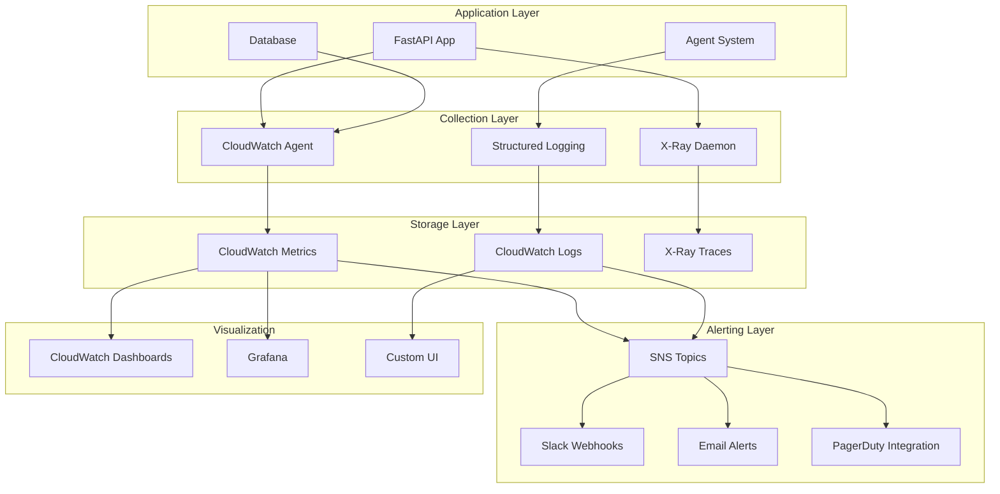

# Monitoring & Observability

## Overview

W.W.H.D. implements comprehensive monitoring across infrastructure, application, and business metrics to ensure system reliability, performance, and user experience.

## Monitoring Stack

### Core Components

| Component | Purpose | Technology | Retention |
|-----------|---------|------------|-----------|
| **Metrics** | Time-series data | CloudWatch | 15 months |
| **Logs** | Application events | CloudWatch Logs | 30 days |
| **Traces** | Request tracking | AWS X-Ray | 30 days |
| **APM** | Application performance | Custom + CloudWatch | 7 days |
| **Uptime** | Service availability | CloudWatch Synthetics | 90 days |

### Monitoring Architecture



## Infrastructure Metrics

### System Metrics

```yaml
infrastructure_metrics:
  compute:
    - namespace: AWS/ECS
      metrics:
        - CPUUtilization
        - MemoryUtilization
        - TaskCount
        - ServiceCount
      dimensions:
        - ClusterName
        - ServiceName

  load_balancer:
    - namespace: AWS/ApplicationELB
      metrics:
        - RequestCount
        - TargetResponseTime
        - HTTPCode_Target_2XX_Count
        - HTTPCode_Target_4XX_Count
        - HTTPCode_Target_5XX_Count
        - UnHealthyHostCount
      dimensions:
        - LoadBalancer
        - TargetGroup

  storage:
    - namespace: AWS/EFS
      metrics:
        - TotalIOBytes
        - DataReadIOBytes
        - DataWriteIOBytes
        - ClientConnections
      dimensions:
        - FileSystemId

monitoring_configuration:
  collection_interval: 60  # seconds
  detailed_monitoring: true
  custom_metrics_enabled: true
```

### Container Metrics

```python
# Custom ECS metrics collection
import boto3
import psutil
from datetime import datetime

class ContainerMetricsCollector:
    def __init__(self):
        self.cloudwatch = boto3.client('cloudwatch')
        self.namespace = 'WWHD/Container'

    async def collect_metrics(self):
        """Collect and send container-level metrics."""

        metrics = [
            {
                'MetricName': 'ProcessCount',
                'Value': len(psutil.pids()),
                'Unit': 'Count',
                'Timestamp': datetime.utcnow()
            },
            {
                'MetricName': 'OpenConnections',
                'Value': len(psutil.net_connections()),
                'Unit': 'Count'
            },
            {
                'MetricName': 'DiskIORead',
                'Value': psutil.disk_io_counters().read_bytes,
                'Unit': 'Bytes'
            },
            {
                'MetricName': 'DiskIOWrite',
                'Value': psutil.disk_io_counters().write_bytes,
                'Unit': 'Bytes'
            }
        ]

        # Add dimensions
        for metric in metrics:
            metric['Dimensions'] = [
                {'Name': 'ServiceName', 'Value': 'wwhd-backend'},
                {'Name': 'Environment', 'Value': os.environ.get('APP_ENV', 'unknown')}
            ]

        # Send to CloudWatch
        self.cloudwatch.put_metric_data(
            Namespace=self.namespace,
            MetricData=metrics
        )
```

## Application Metrics

### API Performance Metrics

```python
from prometheus_client import Counter, Histogram, Gauge
import time

# Define metrics
REQUEST_COUNT = Counter(
    'http_requests_total',
    'Total HTTP requests',
    ['method', 'endpoint', 'status']
)

REQUEST_DURATION = Histogram(
    'http_request_duration_seconds',
    'HTTP request duration',
    ['method', 'endpoint']
)

ACTIVE_SESSIONS = Gauge(
    'active_user_sessions',
    'Number of active user sessions'
)

TOKEN_USAGE = Counter(
    'openai_tokens_total',
    'Total OpenAI tokens used',
    ['model', 'type']
)

AGENT_EXECUTION_TIME = Histogram(
    'agent_execution_seconds',
    'Agent execution time',
    ['agent_name', 'operation']
)

class MetricsMiddleware:
    async def __call__(self, request: Request, call_next):
        start_time = time.time()

        # Execute request
        response = await call_next(request)

        # Record metrics
        duration = time.time() - start_time
        REQUEST_COUNT.labels(
            method=request.method,
            endpoint=request.url.path,
            status=response.status_code
        ).inc()

        REQUEST_DURATION.labels(
            method=request.method,
            endpoint=request.url.path
        ).observe(duration)

        return response
```

### Custom Business Metrics

```python
class BusinessMetricsCollector:
    def __init__(self):
        self.cloudwatch = boto3.client('cloudwatch')

    async def track_chat_completion(self, session_data: dict):
        """Track chat-specific business metrics."""

        metrics = [
            {
                'MetricName': 'ChatCompletionTime',
                'Value': session_data['response_time_ms'],
                'Unit': 'Milliseconds',
                'Dimensions': [
                    {'Name': 'AgentUsed', 'Value': session_data['agent_used']},
                    {'Name': 'Namespace', 'Value': session_data.get('namespace', 'general')}
                ]
            },
            {
                'MetricName': 'TokensUsed',
                'Value': session_data['total_tokens'],
                'Unit': 'Count',
                'Dimensions': [
                    {'Name': 'Model', 'Value': session_data['model']},
                    {'Name': 'TokenType', 'Value': 'total'}
                ]
            },
            {
                'MetricName': 'UserSatisfaction',
                'Value': session_data.get('satisfaction_score', 0),
                'Unit': 'None',
                'Dimensions': [
                    {'Name': 'SessionType', 'Value': session_data['session_type']}
                ]
            }
        ]

        await self.send_metrics(metrics)

business_metrics = [
    'daily_active_users',
    'messages_per_user_per_day',
    'average_session_duration',
    'namespace_popularity',
    'agent_success_rate',
    'user_retention_rate',
    'cost_per_conversation'
]
```

## Logging Strategy

### Structured Logging

```python
import structlog
import json
from datetime import datetime

# Configure structured logging
structlog.configure(
    processors=[
        structlog.processors.TimeStamper(fmt="iso"),
        structlog.processors.add_log_level,
        structlog.processors.JSONRenderer()
    ],
    wrapper_class=structlog.make_filtering_bound_logger(20),  # INFO level
    logger_factory=structlog.PrintLoggerFactory(),
    cache_logger_on_first_use=True,
)

logger = structlog.get_logger()

class ApplicationLogger:
    def __init__(self):
        self.logger = structlog.get_logger()

    def log_chat_request(self, request_data: dict, user_id: str):
        """Log chat requests with context."""
        self.logger.info(
            "chat_request_received",
            user_id=user_id,
            session_id=request_data.get('session_id'),
            message_length=len(request_data.get('content', '')),
            chat_id=request_data.get('chat_id'),
            timestamp=datetime.utcnow().isoformat()
        )

    def log_agent_execution(self, agent_name: str, execution_time: float, success: bool):
        """Log agent execution metrics."""
        self.logger.info(
            "agent_execution_completed",
            agent_name=agent_name,
            execution_time_ms=execution_time * 1000,
            success=success,
            timestamp=datetime.utcnow().isoformat()
        )

    def log_error(self, error: Exception, context: dict):
        """Log errors with full context."""
        self.logger.error(
            "application_error",
            error_type=type(error).__name__,
            error_message=str(error),
            **context,
            timestamp=datetime.utcnow().isoformat()
        )
```

### Log Aggregation

```yaml
log_configuration:
  retention_policy:
    error_logs: 30_days
    access_logs: 7_days
    audit_logs: 365_days
    debug_logs: 1_day

  log_groups:
    - name: /aws/ecs/wwhd-backend/application
      retention: 30
      kms_key: alias/wwhd-logs

    - name: /aws/ecs/wwhd-backend/access
      retention: 7

    - name: /aws/ecs/wwhd-backend/error
      retention: 30

  metric_filters:
    - name: ErrorCount
      pattern: "ERROR"
      metric_name: ApplicationErrors
      metric_namespace: WWHD/Application

    - name: HighLatency
      pattern: "[timestamp, request_id, latency > 5000]"
      metric_name: HighLatencyRequests
      metric_namespace: WWHD/Performance
```

## Distributed Tracing

### X-Ray Configuration

```python
from aws_xray_sdk.core import xray_recorder, patch_all
from aws_xray_sdk.core.context import Context

# Patch common libraries
patch_all()

# Configure X-Ray
xray_recorder.configure(
    context=Context(),
    service='wwhd-backend',
    dynamic_naming='*.wwhd.ai',
    plugins=('ECSPlugin',)
)

class TracingMiddleware:
    async def __call__(self, request: Request, call_next):
        # Create subsegment for this request
        subsegment = xray_recorder.begin_subsegment('http_request')

        try:
            # Add metadata
            subsegment.put_metadata('request', {
                'method': request.method,
                'path': request.url.path,
                'user_agent': request.headers.get('user-agent')
            })

            # Process request
            response = await call_next(request)

            # Add response metadata
            subsegment.put_metadata('response', {
                'status_code': response.status_code
            })

            return response

        except Exception as e:
            # Record exception
            subsegment.add_exception(e)
            raise

        finally:
            xray_recorder.end_subsegment()

@xray_recorder.capture_async('agent_execution')
async def execute_agent(agent_name: str, state: dict):
    """Traced agent execution."""

    # Add annotations for filtering
    xray_recorder.put_annotation('agent_name', agent_name)
    xray_recorder.put_annotation('user_id', state.get('user_id'))

    # Add metadata
    xray_recorder.put_metadata('agent_state', {
        'intent': state.get('intent'),
        'namespaces': state.get('selected_namespaces'),
        'confidence': state.get('confidence')
    })

    # Execute agent logic
    result = await agent_logic(state)

    # Add result metadata
    xray_recorder.put_metadata('agent_result', {
        'success': result.get('success'),
        'tokens_used': result.get('tokens_used')
    })

    return result
```

### Custom Trace Analysis

```python
class TraceAnalyzer:
    def __init__(self):
        self.xray_client = boto3.client('xray')

    async def analyze_slow_requests(self, time_range_minutes: int = 60):
        """Analyze slow requests using X-Ray traces."""

        end_time = datetime.utcnow()
        start_time = end_time - timedelta(minutes=time_range_minutes)

        response = self.xray_client.get_trace_summaries(
            TimeRangeType='TimeRangeByStartTime',
            StartTime=start_time,
            EndTime=end_time,
            FilterExpression='duration >= 5'  # Requests >5 seconds
        )

        slow_traces = []
        for trace_summary in response['TraceSummaries']:
            # Get detailed trace
            trace_detail = self.xray_client.batch_get_traces(
                TraceIds=[trace_summary['Id']]
            )

            slow_traces.append({
                'trace_id': trace_summary['Id'],
                'duration': trace_summary['Duration'],
                'response_time_distribution': trace_summary.get('ResponseTimeRootCauses', []),
                'error_root_causes': trace_summary.get('ErrorRootCauses', [])
            })

        return slow_traces

    async def get_service_map(self):
        """Get service dependency map."""
        response = self.xray_client.get_service_graph(
            StartTime=datetime.utcnow() - timedelta(hours=1),
            EndTime=datetime.utcnow()
        )

        return response['Services']
```

## Alerting & Notifications

### CloudWatch Alarms

```yaml
alarms:
  # High-Severity Alarms
  - name: HighErrorRate
    metric_name: HTTPCode_Target_5XX_Count
    namespace: AWS/ApplicationELB
    statistic: Sum
    period: 300
    evaluation_periods: 2
    threshold: 50
    comparison_operator: GreaterThanThreshold
    alarm_actions:
      - sns:us-west-2:123456789:critical-alerts
    ok_actions:
      - sns:us-west-2:123456789:alert-recovery

  - name: HighCPUUtilization
    metric_name: CPUUtilization
    namespace: AWS/ECS
    statistic: Average
    period: 300
    evaluation_periods: 2
    threshold: 80
    comparison_operator: GreaterThanThreshold
    dimensions:
      - name: ServiceName
        value: wwhd-backend

  - name: HighMemoryUtilization
    metric_name: MemoryUtilization
    namespace: AWS/ECS
    statistic: Average
    period: 300
    evaluation_periods: 2
    threshold: 85
    comparison_operator: GreaterThanThreshold

  # Medium-Severity Alarms
  - name: HighLatency
    metric_name: TargetResponseTime
    namespace: AWS/ApplicationELB
    statistic: Average
    period: 300
    evaluation_periods: 3
    threshold: 5000  # 5 seconds
    comparison_operator: GreaterThanThreshold
    alarm_actions:
      - sns:us-west-2:123456789:warning-alerts

  - name: UnhealthyTargets
    metric_name: UnHealthyHostCount
    namespace: AWS/ApplicationELB
    statistic: Average
    period: 60
    evaluation_periods: 1
    threshold: 1
    comparison_operator: GreaterThanOrEqualToThreshold

  # Custom Application Alarms
  - name: HighTokenUsage
    metric_name: TokensPerMinute
    namespace: WWHD/Application
    statistic: Sum
    period: 300
    evaluation_periods: 2
    threshold: 10000
    comparison_operator: GreaterThanThreshold
```

### Alert Routing

```python
class AlertManager:
    def __init__(self):
        self.sns_client = boto3.client('sns')
        self.slack_webhook = os.environ.get('SLACK_WEBHOOK_URL')

    async def send_alert(self, severity: str, message: str, details: dict):
        """Send alerts based on severity."""

        alert_data = {
            'timestamp': datetime.utcnow().isoformat(),
            'severity': severity,
            'message': message,
            'details': details,
            'service': 'wwhd-backend'
        }

        # Route based on severity
        if severity == 'critical':
            await self.send_sns_alert('critical-alerts', alert_data)
            await self.send_slack_alert(alert_data)
            await self.send_pagerduty_alert(alert_data)

        elif severity == 'warning':
            await self.send_sns_alert('warning-alerts', alert_data)
            await self.send_slack_alert(alert_data)

        elif severity == 'info':
            await self.send_slack_alert(alert_data)

    async def send_slack_alert(self, alert_data: dict):
        """Send alert to Slack."""
        slack_message = {
            "channel": "#wwhd-alerts",
            "username": "WWHD Monitor",
            "icon_emoji": ":warning:" if alert_data['severity'] == 'critical' else ":information_source:",
            "attachments": [
                {
                    "color": "danger" if alert_data['severity'] == 'critical' else "warning",
                    "fields": [
                        {
                            "title": "Service",
                            "value": alert_data['service'],
                            "short": True
                        },
                        {
                            "title": "Severity",
                            "value": alert_data['severity'].upper(),
                            "short": True
                        },
                        {
                            "title": "Message",
                            "value": alert_data['message'],
                            "short": False
                        }
                    ],
                    "ts": int(datetime.utcnow().timestamp())
                }
            ]
        }

        async with httpx.AsyncClient() as client:
            await client.post(self.slack_webhook, json=slack_message)
```

## Dashboards

### CloudWatch Dashboard

```json
{
  "widgets": [
    {
      "type": "metric",
      "properties": {
        "metrics": [
          ["AWS/ApplicationELB", "RequestCount", "LoadBalancer", "wwhd-alb"],
          [".", "TargetResponseTime", ".", "."],
          ["AWS/ECS", "CPUUtilization", "ServiceName", "wwhd-backend"],
          [".", "MemoryUtilization", ".", "."]
        ],
        "period": 300,
        "stat": "Average",
        "region": "us-west-2",
        "title": "Application Overview"
      }
    },
    {
      "type": "log",
      "properties": {
        "query": "SOURCE '/aws/ecs/wwhd-backend'\n| fields @timestamp, level, message\n| filter level = \"ERROR\"\n| sort @timestamp desc\n| limit 20",
        "region": "us-west-2",
        "title": "Recent Errors"
      }
    }
  ]
}
```

### Custom Grafana Dashboard

```yaml
dashboard:
  title: "WWHD Application Metrics"
  panels:
    - title: "API Request Rate"
      type: graph
      targets:
        - expr: rate(http_requests_total[5m])
          legend: "{{method}} {{endpoint}}"

    - title: "Agent Performance"
      type: graph
      targets:
        - expr: histogram_quantile(0.95, agent_execution_seconds_bucket)
          legend: "95th percentile"
        - expr: histogram_quantile(0.50, agent_execution_seconds_bucket)
          legend: "50th percentile"

    - title: "Token Usage"
      type: stat
      targets:
        - expr: sum(rate(openai_tokens_total[1h])) * 3600
          legend: "Tokens per hour"

    - title: "Active Users"
      type: stat
      targets:
        - expr: active_user_sessions
          legend: "Current sessions"

    - title: "Error Rate"
      type: stat
      targets:
        - expr: rate(http_requests_total{status=~"5.."}[5m]) / rate(http_requests_total[5m]) * 100
          legend: "Error percentage"
```

## Performance Monitoring

### SLI/SLO Definition

```yaml
service_level_objectives:
  availability:
    target: 99.9%
    measurement_window: 30_days
    error_budget: 43.2_minutes

  latency:
    target: 95th_percentile < 2000ms
    measurement_window: 7_days

  throughput:
    target: "> 100 requests/second"
    measurement_window: 1_day

  error_rate:
    target: "< 1%"
    measurement_window: 1_day

service_level_indicators:
  availability:
    good_events: "http_requests_total{status!~'5..'}"
    total_events: "http_requests_total"

  latency:
    good_events: "http_request_duration_seconds <= 2.0"
    total_events: "http_requests_total"

  error_rate:
    bad_events: "http_requests_total{status=~'5..'}"
    total_events: "http_requests_total"
```

### Synthetic Monitoring

```python
import asyncio
import httpx
from datetime import datetime

class SyntheticMonitor:
    def __init__(self):
        self.base_url = "https://api.wwhd.ai"
        self.cloudwatch = boto3.client('cloudwatch')

    async def run_health_check(self):
        """Synthetic health check with detailed timing."""

        start_time = time.time()

        try:
            async with httpx.AsyncClient(timeout=30.0) as client:
                response = await client.get(f"{self.base_url}/health")

            response_time = (time.time() - start_time) * 1000
            success = response.status_code == 200

            # Send metrics to CloudWatch
            await self.send_synthetic_metrics(
                response_time=response_time,
                success=success,
                status_code=response.status_code
            )

        except Exception as e:
            response_time = (time.time() - start_time) * 1000
            await self.send_synthetic_metrics(
                response_time=response_time,
                success=False,
                error=str(e)
            )

    async def run_full_api_test(self):
        """Full API workflow test."""

        test_results = {
            'register': await self.test_registration(),
            'login': await self.test_login(),
            'chat': await self.test_chat_flow(),
            'health': await self.test_health_endpoint()
        }

        # Calculate overall success rate
        total_tests = len(test_results)
        successful_tests = sum(1 for result in test_results.values() if result['success'])
        success_rate = successful_tests / total_tests * 100

        await self.send_synthetic_metrics(
            test_type='full_workflow',
            success_rate=success_rate,
            total_response_time=sum(r['response_time'] for r in test_results.values())
        )

# Run synthetic monitoring
if __name__ == "__main__":
    monitor = SyntheticMonitor()
    asyncio.run(monitor.run_full_api_test())
```

---

*For security best practices, see [Security Guide](../deployment/security)*