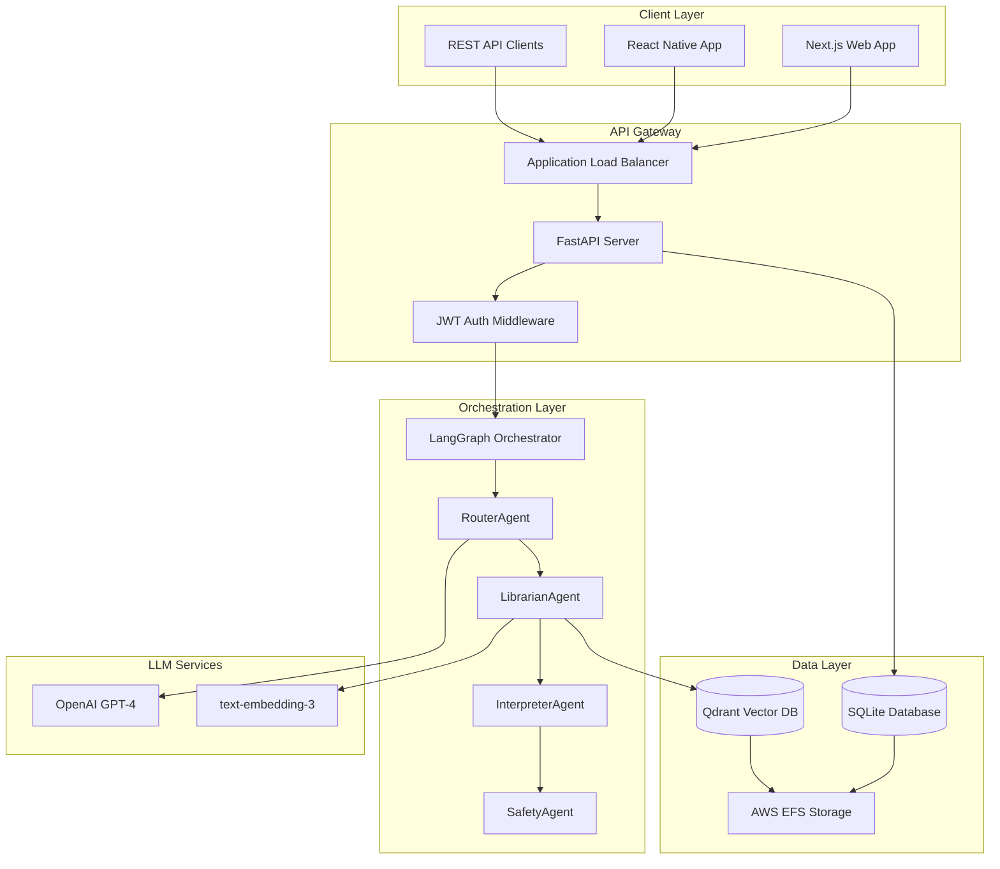

# System Overview

## Introduction

W.W.H.D. (What Would Herman Do?) is an AI-powered wisdom companion that combines ancient Shaolin philosophy, Traditional Chinese Medicine principles, and modern machine learning to provide personalized guidance. Built on a sophisticated multi-agent architecture using LangGraph and FastAPI, the system delivers context-aware responses through intelligent agent routing and retrieval-augmented generation (RAG).

## Key Features

### 🧠 **Intelligent Multi-Agent System**
- **RouterAgent**: Classifies intent and determines optimal response path
- **LibrarianAgent**: Performs hybrid retrieval from vector knowledge base
- **InterpreterAgent**: Generates contextual responses with Herman's personality
- **SafetyAgent**: Ensures appropriate content filtering and ethical guidelines

### 🔐 **Enterprise-Grade Security**
- JWT-based authentication with refresh tokens
- Role-based access control (RBAC)
- Rate limiting and DDoS protection
- End-to-end encryption for sensitive data

### ⚡ **Production-Ready Infrastructure**
- Auto-scaling ECS Fargate deployment
- Application Load Balancer with health checks
- Persistent storage with AWS EFS
- Real-time monitoring via CloudWatch

### 📚 **Advanced RAG Pipeline**
- Qdrant vector database with namespace isolation
- Hybrid search combining semantic and keyword matching
- Dynamic chunk sizing and reranking
- Source attribution and citation tracking

## System Architecture

## Technology Stack

### Backend Services
| Component | Technology | Version | Purpose |
|-----------|------------|---------|---------|
| API Server | FastAPI | 0.100+ | REST endpoints, WebSocket/SSE streaming |
| Agent Orchestrator | LangGraph | 0.1+ | Multi-agent state machine |
| Vector Store | Qdrant | 1.7+ | RAG retrieval with namespaces |
| Database | SQLite | 3.35+ | User management, chat history |
| Container Runtime | Docker | 24+ | Application containerization |
| Cloud Platform | AWS ECS Fargate | - | Serverless container hosting |

### AI/ML Stack
| Component | Technology | Purpose |
|-----------|------------|---------|
| LLM Provider | OpenAI API | Response generation |
| Chat Model | GPT-4o-mini | Cost-effective inference |
| Embeddings | text-embedding-3-small | Vector search |
| Safety Filters | Custom + OpenAI | Content moderation |

### Frontend (Separate Repository)
| Component | Technology | Purpose |
|-----------|------------|---------|
| Web Framework | Next.js 14 | React-based UI |
| UI Components | assistant-ui | Chat interface |
| Deployment | AWS Amplify | Static site hosting |
| State Management | React Context | Client state |

## Performance Characteristics

### Current Benchmarks
- **Chat Response Time**: ~11.5s average (with OpenAI)
- **Authentication**: < 500ms
- **Vector Search**: < 2s for 10k documents
- **Concurrent Users**: 50+ supported
- **Auto-scaling**: 2-10 container instances

### Optimization Strategies
- Aggressive caching of embeddings
- Batch processing for document ingestion
- Connection pooling for database
- CDN for static assets
- Response streaming via SSE

## Use Cases

### 1. **Personal Wisdom Companion**
Users seeking guidance on life decisions, relationships, and personal growth receive contextual advice grounded in Eastern philosophy.

### 2. **Meditation & Mindfulness Guide**
Practitioners access tailored meditation techniques, breathing exercises, and mindfulness practices based on their experience level.

### 3. **TCM & Wellness Advisor**
Health-conscious individuals get recommendations on nutrition, herbs, and lifestyle adjustments following Traditional Chinese Medicine principles.

### 4. **Feng Shui Consultant**
Homeowners and businesses receive spatial arrangement guidance to optimize energy flow and harmony in their environments.

### 5. **Philosophical Study Aid**
Students and enthusiasts explore Shaolin teachings, Buddhist philosophy, and ancient wisdom through interactive dialogue.

## Getting Started

### For Developers
1. Review the [Architecture Guide](../architecture/system-design)
2. Follow the [Local Development Setup](../development/local-setup)
3. Explore the [API Reference](../api-reference)
4. Check the [Setup Guide](../setup)

### For System Administrators
1. Start with [AWS Infrastructure](../deployment/aws-infrastructure)
2. Configure [Security Best Practices](../deployment/security)
3. Set up [Monitoring & Alerts](../operations/monitoring)
4. Review [Troubleshooting Guide](../troubleshooting)

### For End Users
1. Read the [Introduction](../intro)
2. Try the [API Examples](../examples)
3. Import the [Postman Collection](pathname:///WWHD.postman_collection.json)
4. Join our [Community Forum](https://github.com/wbaxterh/wwhd/discussions)

## Project Status

### ✅ Completed
- Core multi-agent system with LangGraph
- JWT authentication and user management
- ECS Fargate deployment pipeline
- Qdrant vector database integration
- GitHub Actions CI/CD
- Comprehensive API documentation

### 🚧 In Progress
- Frontend application (Next.js)
- Admin dashboard for content management
- Advanced reranking algorithms
- Performance optimization

### 📋 Planned
- Mobile application (React Native)
- Voice interface integration
- Multi-language support
- Advanced analytics dashboard
- Webhook integrations

## Support

- **Documentation**: You're reading it!
- **API Status**: http://wwhd-alb-1530831557.us-west-2.elb.amazonaws.com/health
- **GitHub Issues**: [Report bugs or request features](https://github.com/wbaxterh/wwhd/issues)
- **Discussions**: [Community forum](https://github.com/wbaxterh/wwhd/discussions)

---

*Last updated: November 2025*